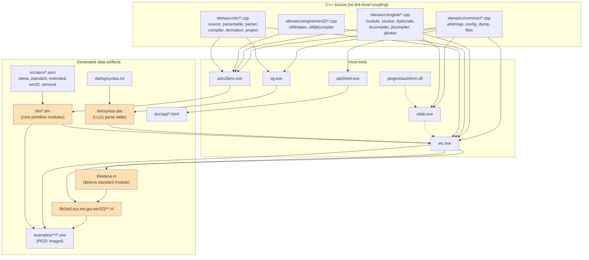

# ELENA 1.5.0.0 — Build System, Auxiliary Tools, Bootstrap & CMake Migration

> **Status of this document:** written from the 2009 source tree exactly as checked out,
> before any modernization work. Section 9 (CMake plan) and section 10 (Linux blockers)
> are the only forward-looking parts; everything else describes the tree *as it is*.
>
> All paths are relative to the repository root (`/home/bencz/programming/ELENA-1.5.0.0`).
> Anchors are given as `path:line`.

---

## 1. Current build targets

The tree ships **two parallel, hand-maintained build systems** and no generator:

* **CodeBlocks + MinGW32** — `elena.workspace` plus five `.cbp` files. This is the
  *primary* system; `readme.txt:95` says *"The project source code is compiled with
  CodeBlocks and Mingw32"*.
* **Visual Studio** — `.vcproj` (VS 7.1/2003, VS 8/2005, VS 9/2008) and `.vcxproj`
  (VS 10/2010). There is **no `.sln`** anywhere in the tree, so the VS projects must be
  opened individually.

There is **no makefile, no shell script, no batch file** of any kind:

```
find . -name "Makefile*" -o -name "*.mk" -o -name "*.sh" -o -name "*.bat" -o -name "*.sln"
→ (empty)
```

### 1.1 Target overview

| Target | Type | Primary sources | Shared sources | Libraries | Platform | Output |
|---|---|---|---|---|---|---|
| **sg** | console exe | `elenasrc/sg/sg.cpp` | `common/{altstrings,config,dump,files}.cpp`, `elc/{parsertable,source}.cpp` | CRT only | Win32 (portable in principle) | `bin/sg.exe` |
| **asm2binx** | console exe | `elenasrc/asm2bin/{asm2binx,x86assembler,x86jumphelper}.cpp` | `common/{altstrings,dump,files}.cpp`, `elc/source.cpp`, `engine/{module,section}.cpp`, `engine/win32/x86helper.cpp` | CRT only | Win32 host, x86 target | `bin/asm2binx.exe` |
| **elc** | console exe | `elenasrc/elc/*.cpp` + `elc/win32/{elc,linker}.cpp` | `common/*.cpp`, `engine/*.cpp`, `engine/win32/*.cpp` | `kernel32` (implicit), Win32 API | Win32 only | `bin/elc.exe` |
| **elide** | GUI exe | `elenasrc/ide/*.cpp` + `ide/win32/*.cpp` + `ide/ide.rc` | `common/*.cpp`, `engine/{module,section}.cpp` | `comctl32`, `shlwapi`, `gdi32`, `user32`, `kernel32` | Win32 only | `bin/elide.exe` |
| **elide-gtk** | GUI exe | `elenasrc/ide/gtk/main.cpp` | — | GTK+ 2.0 (`pkg-config`) | Linux | `bin/{Debug,Release}/elide-gtk` |
| **api2html** | console exe | `elenasrc/api2html/api2html.cpp` | `common/{altstrings,config,files}.cpp` | CRT only | portable (ANSI-only) | `bin/api2html.exe` |
| **autoform** | DLL (plugin) | `elenasrc/plugins/autoform/autoform.cpp`, `plugins/autoform/win32/dllmain.cpp` | — | Win32 API | Win32 only | `bin/plugins/autoform.dll` |

> **`elide-gtk` is a decoy.** `elenasrc/ide/gtk/main.cpp` is a 49-line GTK+ 2.0
> "Hello World" dialog (`elenasrc/ide/gtk/main.cpp:8`). It contains *zero* IDE code and
> is not referenced by `elena.workspace`. Treat it as an abandoned spike, not as a
> portable IDE.

### 1.2 Per-target detail — CodeBlocks (`.cbp`)

CodeBlocks merges the project-level `<Compiler>`/`<Linker>` blocks with the target-level
ones. Effective flags below are the union.

#### sg — `elenasrc/sg/codeblocks/sg.cbp`

| Property | Value | Anchor |
|---|---|---|
| Output | `..\..\..\bin\sg.exe` | `sg.cbp:10` |
| Object dir | `..\temp` (i.e. `elenasrc/sg/temp`) | `sg.cbp:11` |
| Type | `1` = console executable | `sg.cbp:12` |
| Debug run args | `D:\Alex\PROJECTS\elena.2\dat\sg\syntax.txt` (hard-coded author path) | `sg.cbp:14` |
| Compiler (target) | `-march=i686 -O3 -D_UNICODE -DUNICODE` | `sg.cbp:17-20` |
| Compiler (project) | `-march=pentium2 -O3 -W` | `sg.cbp:35-37` |
| Includes | `..`, `..\..\common`, `..\..\engine`, `..\..\elc` | `sg.cbp:21-24` |
| Linker | `-s` (strip) | `sg.cbp:27`, `sg.cbp:40` |
| Libraries | none | — |

Sources (7 `.cpp`): `common/altstrings.cpp`, `common/config.cpp`, `common/dump.cpp`,
`common/files.cpp`, `elc/parsertable.cpp`, `elc/source.cpp`, `sg/sg.cpp`.

> Note the **contradictory `-march`**: `pentium2` at project level and `i686` at target
> level. GCC takes the last one on the command line; either way this is a 1999-era ISA
> constraint that no longer serves any purpose.

#### asm2bin — `elenasrc/asm2bin/codeblocks/asm2bin.cbp`

| Property | Value | Anchor |
|---|---|---|
| Output | `..\..\..\bin\asm2binx.exe` | `asm2bin.cbp:10` |
| Type | `1` = console executable | `asm2bin.cbp:12` |
| Compiler (target) | `-march=pentium2 -O3 -D_UNICODE -DUNICODE` | `asm2bin.cbp:16-19` |
| Compiler (project) | `-march=pentium2 -O3 -W` | `asm2bin.cbp:30-32` |
| Includes | `..`, `..\..\common`, `..\..\engine`, `..\..\elc` | `asm2bin.cbp:33-36` |
| Linker | `-s` | `asm2bin.cbp:22`, `asm2bin.cbp:39` |

Sources (10 `.cpp`): `asm2bin/{asm2binx,x86assembler,x86jumphelper}.cpp`,
`common/{altstrings,dump,files}.cpp`, `elc/source.cpp`, `engine/{module,section}.cpp`,
`engine/win32/x86helper.cpp`.

#### elc — `elenasrc/elc/codeblocks/elc.cbp`

| Property | Value | Anchor |
|---|---|---|
| Output | `..\..\..\bin\elc.exe` | `elc.cbp:10` |
| Working dir | `..\..\..\bin` | `elc.cbp:11` |
| Type | `1` = console executable | `elc.cbp:13` |
| Debug run args | `-cD:\Alex\PROJECTS\elena.2\examples\sample1\sample.prj` (path does not exist in this tree) | `elc.cbp:15` |
| Compiler | `-march=pentium2 -O3 -W -D_UNICODE -DUNICODE -Dmingw49` | `elc.cbp:18-23` |
| Includes | `..`, `..\..\common`, `..\win32`, `..\..\engine` | `elc.cbp:24-27` |
| Linker | `-s` | `elc.cbp:30`, `elc.cbp:38` |
| Libraries | none listed; `kernel32` comes in via MinGW defaults | — |

Sources (20 `.cpp`): `common/{altstrings,config,dump,files}.cpp`,
`elc/{compiler,derivation,parser,parsertable,project,source}.cpp`,
`elc/win32/{elc,linker}.cpp`,
`engine/{bccompiler,bytecode,jitcompiler,jitlinker,module,section}.cpp`,
`engine/win32/{x86helper,x86jitcompiler}.cpp`.

Two quirks:

* `elc.cbp:135` lists `..\win32\x86opcodes.h ` (**with a trailing space**) as a unit.
  That file **does not exist** in this checkout. It is marked
  `target=<{~None~}>` so it is never compiled — a stale, harmless reference.
* The CodeBlocks project omits `engine/win32/imagesection.cpp`, which the VS projects
  include. This is also harmless: `elenasrc/engine/win32/imagesection.h:12-14` declares
  an **empty namespace** and `imagesection.cpp` defines no symbols. Both files are
  vestigial.

`-Dmingw49` is consumed at exactly one place: `elenasrc/elc/win32/linker.cpp:468`, which
skips setting `IMAGE_OPTIONAL_HEADER::Win32VersionValue` because that member is absent
from old MinGW headers.

#### elide (Win32) — `elenasrc/ide/codeblocks/elide_win32.cbp`

| Property | Value | Anchor |
|---|---|---|
| Output | `..\..\..\bin\elide.exe` | `elide_win32.cbp:10` |
| Type | `0` = GUI executable | `elide_win32.cbp:13` |
| Compiler | `-march=pentium2 -O3 -O -W -D_UNICODE -DUNICODE -Dmingw49` | `elide_win32.cbp:17-22`, `:45-47` |
| Includes | `..`, `..\win32`, `..\..\common`, `..\..\elc`, `..\..\engine`, `..\..\idecommon` | `elide_win32.cbp:23-28` |
| Resource include dirs | `..`, `.` | `elide_win32.cbp:31-32` |
| Linker | `-s` | `elide_win32.cbp:35` |
| **Libraries (absolute!)** | `C:\MinGW\lib\libshlwapi.a`, `C:\MinGW\lib\libcomctl32.a` | `elide_win32.cbp:36-37` |
| Libraries (by name) | `gdi32`, `user32`, `kernel32` | `elide_win32.cbp:51-53` |
| Resource | `..\ide.rc` compiled with `WINDRES` | `elide_win32.cbp:120-122` |

Sources (32 `.cpp` + 1 `.rc`): `common/{altstrings,config,dump,files}.cpp`,
`engine/{module,section}.cpp`,
`ide/{browser,debugcontroller,document,ideproject,idesettings,layout,messagelog,pluginmanager,sourcedoc,text}.cpp`,
`ide/win32/{accelerator,appwindow,debugger,dialogs,editframe,idecommon,listview,menu,output,splitter,statusbar,tabbar,toolbar,treeview,window,winmain}.cpp`.

> The absolute `C:\MinGW\lib\...` paths are the exact problem `readme.txt:99-101` warns
> about. In CMake these become plain `shlwapi` / `comctl32` link items.

#### api2html — `elenasrc/api2html/codeblocks/api2html.cbp`

| Property | Value | Anchor |
|---|---|---|
| Output | `..\..\..\bin\api2html.exe` | `api2html.cbp:10` |
| Compiler | `-march=pentium2 -O3 -W` — **no `-D_UNICODE`** | `api2html.cbp:28-30` |
| Includes | `..`, `..\..\common` | `api2html.cbp:16-17` |
| Linker | `-s` | `api2html.cbp:20`, `:33` |

Sources (4 `.cpp`): `api2html/api2html.cpp`, `common/{altstrings,config,files}.cpp`.

`api2html.cpp` uses raw `char*` throughout (never `TCHAR`), so it is the only tool that
is *deliberately* ANSI-only. This is mirrored in VS by `CharacterSet="0"` /
`<CharacterSet>NotSet</CharacterSet>` (`api2html.vcproj:18`, `api2html10.vcxproj:25`).

#### elide-gtk — `elenasrc/ide/codeblocks/elide_gtk.cbp`

| Property | Value | Anchor |
|---|---|---|
| Targets | `Debug` (`-g`), `Release` (`-O2`, `-s`) | `elide_gtk.cbp:9-29` |
| Compiler | `` `pkg-config gtk+-2.0 --cflags` ``, `-Wall` | `elide_gtk.cbp:32-33` |
| Linker | `` `pkg-config gtk+-2.0 --libs` `` | `elide_gtk.cbp:36` |
| Sources | `../gtk/main.cpp` (compiled as **C**, `compilerVar="CC"`) | `elide_gtk.cbp:38-40` |

### 1.3 Per-target detail — Visual Studio

All VS configurations are **Win32/x86 only** (`TargetMachine=MachineX86`,
`<Platform>Win32</Platform>`). Every project has exactly two configurations,
`Debug|Win32` and `Release|Win32`.

| Project file | VS ver | Include dirs | Defines (Debug) | Defines (Release) | CharacterSet D/R | Output (Debug) | Status |
|---|---|---|---|---|---|---|---|
| `sg/vs/sg.vcproj` | 7.1/8 | `..\..\common;..\..\elc;..` | `WIN32;_DEBUG;_CONSOLE` | `WIN32;NDEBUG;_CONSOLE` | Unicode / MultiByte | `..\..\..\bin\sg.exe` | **broken** |
| `sg/vs/sg9.vcproj` | 9 | `+..\..\engine` | same | same | Unicode / MultiByte | `..\..\..\bin\sg.exe` | OK |
| `sg/vs/sg10.vcxproj` | 10 | `..\..\common;..\..\elc;..;..\..\engine` | same | same | Unicode / MultiByte | `..\..\..\bin\sg.exe` | OK |
| `asm2bin/vs/asm2binx.vcproj` | 7.1/8 | `..\..\common;..\..\elc;..` | `WIN32;_DEBUG;_CONSOLE` | `WIN32;NDEBUG;_CONSOLE` | Unicode / MultiByte | `..\..\..\bin\asm2binx.exe` | **broken** |
| `asm2bin/vs/asm2binx7.vcproj` | 7.1 | identical to above | same | same | Unicode / MultiByte | `..\..\..\bin\asm2binx.exe` | **broken** |
| `asm2bin/vs/asm2binx9.vcproj` | 9 | `+..\..\engine` | same | same | Unicode / MultiByte | `..\..\..\bin\asm2binx.exe` | OK |
| `asm2bin/vs/asm2binx10.vcxproj` | 10 | `..\..\common;..\..\elc;..;..\..\engine` | same | same | Unicode / MultiByte | `$(OutDir)asm2binx.exe` | OK |
| `elc/vs/elc9.vcproj` | 9 | `..;..\..\common;..\..\engine` | `WIN32;_DEBUG;_CONSOLE;UNICODE` | `WIN32;NDEBUG;_CONSOLE` | Unicode / MultiByte | `$(OutDir)/elc.exe` | OK |
| `elc/vs/el10.vcxproj` | 10 | `..;..\..\common;..\..\engine` | `WIN32;_DEBUG;_CONSOLE;UNICODE` | `WIN32;NDEBUG;_CONSOLE` | Unicode / MultiByte | `$(OutDir)elc.exe` | OK |
| `ide/vc/elide7.vcproj` | 7.1 | `..\..\elc;..\..\common;..;..\win32` | `WIN32;_DEBUG;_WINDOWS` | `WIN32;NDEBUG;_WINDOWS` | Unicode / MultiByte | `$(OutDir)/elide.exe` | stale includes |
| `ide/vc/elide8.vcproj` | 8 | same as elide7 | same | same | Unicode / MultiByte | `$(OutDir)/elide.exe` | stale includes |
| `ide/vc/elide9.vcproj` | 9 | `+..\..\engine;..\..\idecommon` | same | same | Unicode / MultiByte | `$(OutDir)/elide.exe` | OK |
| `ide/vc/elide10.vcxproj` | 10 | `..\..\elc;..\..\common;..;..\win32;..\..\engine;..\..\idecommon` | same | same | Unicode / MultiByte | `$(OutDir)elide.exe` | OK |
| `api2html/vs/api2html.vcproj` | 7.1/8 | `..\..\common` | `WIN32;_DEBUG;_CONSOLE` | `WIN32;NDEBUG;_CONSOLE` | NotSet / MultiByte | `..\..\..\bin\api2html.exe` | OK |
| `api2html/vs/api2html9.vcproj` | 9 | `..\..\common` | same | same | NotSet / MultiByte | `..\..\..\bin\api2html.exe` | OK |
| `api2html/vs/api2html10.vcxproj` | 10 | `..\..\common` | same | same | MultiByte / NotSet | `..\..\..\bin\api2html.exe` | OK |
| `plugins/autoform/vs/autoform.vcproj` | 8 | `..\;..\..\..\common;..\..\..\idecommon` | `WIN32;_DEBUG;_WINDOWS;_USRDLL;EVM_EXPORTS` | `WIN32;NDEBUG;_WINDOWS;_USRDLL;EVM_EXPORTS` | Unicode / Unicode | `..\..\..\..\bin\plugins\autoform.dll` | OK |

**"broken" means the project references files that do not exist in this tree.**
`sg.vcproj:193`, `sg.vcproj:201`, `asm2binx.vcproj:129`, `asm2binx.vcproj:132`,
`asm2binx7.vcproj:129`, `asm2binx7.vcproj:132` all reference `..\..\elc\module.cpp` and
`..\..\common\section.cpp`. Those two files were moved to `elenasrc/engine/` at some
point and the VS 7/8 projects were never updated. Only the `9` and `10` variants are
usable.

Two more VS oddities worth carrying forward:

* Almost every **Release** configuration links to `$(OutDir)/vs.exe` — a copy/paste
  artefact (`sg.vcproj:139`, `asm2binx.vcproj:80`, `api2html10.vcxproj:81`, …). Only
  Debug produces correctly-named binaries. This means *the VS Release builds have never
  been used*.
* `sg10.vcxproj:76` sets `<PrecompiledHeader>Use</PrecompiledHeader>` for Release with no
  PCH source anywhere — another broken Release config.

| MSVC `RuntimeLibrary` code | Meaning | Modern equivalent |
|---|---|---|
| `0` / `MultiThreaded` | `/MT` | `MSVC_RUNTIME_LIBRARY MultiThreaded` |
| `1` / `MultiThreadedDebug` | `/MTd` | `MultiThreadedDebug` |
| `2` | `/MD` | `MultiThreadedDLL` |
| `3` | `/MDd` | `MultiThreadedDebugDLL` |
| `4` | `/ML` (VS7 single-threaded) | *removed from MSVC* |
| `5` | `/MLd` (VS7 single-threaded debug) | *removed from MSVC* |

`asm2binx.vcproj:26/71` and `api2html.vcproj:26/71` still use `4`/`5` — the
single-threaded CRT, **deleted from MSVC in VS2005**. Another reason the VS7 projects
cannot be opened today.

### 1.4 Resource file

`elenasrc/ide/ide.rc` (351 lines) is the only resource script. It defines:

| Kind | Identifiers | Anchor |
|---|---|---|
| Icon | `IDI_APP_ICON` ← `icons\elgui.ico` | `ide.rc:6` |
| Bitmaps (16) | `IDR_FILENEW`, `IDR_FILEOPEN`, `IDR_FILESAVE`, `IDR_SAVEALL`, `IDR_CLOSEFILE`, `IDR_CLOSEALL`, `IDR_CUT`, `IDR_COPY`, `IDR_PASTE`, `IDR_UNDO`, `IDR_REDO`, `IDR_RUN`, `IDR_STOP`, `IDR_STEPINTO`, `IDR_STEPOVER`, `IDR_GOTO` | `ide.rc:10-25` |
| Menu | `IDR_MAIN_MENU` | `ide.rc:29-150` |
| Accelerators | `IDR_IDE_ACCELERATORS` (52 entries) | `ide.rc:154-206` |
| Dialogs (8) | `IDD_SETTINGS`, `IDD_FORWARDS`, `IDD_GOTOLINE`, `IDD_WINDOWS`, `IDD_EDITOR_SETTINGS`, `IDD_EDITOR_FIND`, `IDD_EDITOR_REPLACE`, `IDD_ABOUT` | `ide.rc:210-351` |

It includes `ideconst.h` (`ide.rc:1`) and `windows.h` (`ide.rc:2`).
**All 17 referenced image files (`elenasrc/ide/icons/*`) are missing from this checkout** —
see §8.

---

## 2. Build order & dependency graph

### 2.1 Compile-time (C++) dependencies

There are **no inter-target link dependencies** — every target statically recompiles the
shared `common/`, `engine/` and `elc/` sources it needs. There are no static libraries.
Therefore the six executables can be built in **any order, fully in parallel**.

The ordering that matters is the **artifact** ordering: `sg` and `asm2binx` produce data
that `elc` consumes at run time, and `elc` produces data that the library and examples
consume.



Dotted edges are **run-time** dependencies (`elide.exe` shells out to `elc.exe`;
`elide.exe` loads plugin DLLs from `bin/plugins/`).

### 2.2 Mandatory execution order

| # | Step | Produces | Consumed by |
|---|---|---|---|
| 1 | build `sg` | `bin/sg.exe` | step 3 |
| 1 | build `asm2binx` | `bin/asm2binx.exe` | step 4 |
| 1 | build `elc` | `bin/elc.exe` | steps 5-7 |
| 2 | build `elide` *(optional)* | `bin/elide.exe` | — |
| 3 | run `sg dat/sg/syntax.txt`, copy result to `bin/syntax.dat` | LL(1) table | `elc` at startup |
| 4 | run `asm2binx src/asm/<n>.asm bin` ×5 | `bin/*.bin` | `elc` linker/JIT |
| 5 | run `elc -lstd -g$elena src/elena.l` → `lib/elena.nl` | core module | every later compile |
| 6 | run `elc -c src/std/std.prj`, then `sys`, `ext`, `win32`, `win32/socket`, `gui` | `lib/**.nl` | examples |
| 7 | run `elc -c examples/helloworld/helloworld.prj` | `helloworld.exe` | — |

---

## 3. Toolchain requirements as of 2009, and why they no longer work

### 3.1 What was assumed

| Assumption | Evidence | Reality in 2026 |
|---|---|---|
| **MinGW32 / GCC 3.4-4.x** | `elena.workspace`, all `.cbp` use `compiler="gcc"`; `readme.txt:95` | Modern GCC/Clang reject several constructs used here (§10) |
| **CodeBlocks 8.02-era project format** | `<FileVersion major="1" minor="6"/>` in every `.cbp` | CodeBlocks still opens these, but nobody wants an IDE-only build |
| **MSVC 7.1 / 8 / 9 / 10** | `.vcproj` `Version="7.10"…"9.00"`, `.vcxproj` `ToolsVersion="4.0"` | `.vcproj` support removed from MSBuild after VS2010; `RuntimeLibrary` 4/5 (`/ML`, `/MLd`) removed in VS2005 |
| **32-bit x86 only** | `TargetMachine="1"` (MachineX86) everywhere; `-march=pentium2`; `IMAGE_FILE_MACHINE_I386` at `elenasrc/elc/win32/linker.cpp:429` | Default toolchains are 64-bit; `-m32` needs `glibc-devel.i686` etc. |
| **C++98 with MSVC extensions** | `__int64` at `elenasrc/common/altstrings.h:84-85`; `#pragma warning(disable:4996)` at `elenasrc/common/common.h:12` | `__int64` is not a GCC/Clang type |
| **Microsoft `<tchar.h>` `TCHAR` model** | `elenasrc/common/common.h:14`; `_T()`/`_tcs*`/`_tfopen` used in 32 files | `<tchar.h>` does not exist outside Windows |
| **Microsoft `<io.h>`, `<direct.h>`** | `common/common.h:18`, `common/files.cpp:13`, `ide/idesettings.cpp:10`, `ide/win32/idecommon.cpp:8` | POSIX equivalents are `<unistd.h>`, `<sys/stat.h>` |
| **Backslash path separators inside `#include`** | 5 sites — see §10 | GCC/Clang on Linux do not translate `\` to `/` |
| **Backslash path separators in data** | `elenasrc/common/files.h:26,65,84,105,181` hard-code `'\\'`; `.cfg`/`.prj` values use `..\lib` | Breaks all path handling on POSIX |
| **Win32 PE output format** | `elenasrc/elc/win32/linker.cpp:427-530` writes `IMAGE_FILE_HEADER` / `IMAGE_OPTIONAL_HEADER` directly | An ELF writer must be built from scratch |
| **`windows.h`, `commctrl.h`, `shlwapi.h`** | `common/win32/unicode.h:15`, `elc/win32/elc.cpp:19`, `elc/win32/linker.cpp:14`, `ide/win32/idecommon.h:19-21`, `ide/win32/debugger.h:11`, `plugins/autoform/autoform.h:14` | Not available |
| **`CommandLineToArgvW` for `main`** | `elenasrc/elc/win32/elc.cpp:255-258` — `main()` takes **no arguments** and gets `argv` from the Win32 API | Hard-blocks `elc` on any non-Windows host |
| **Absolute developer paths** | `C:\MinGW\lib\libshlwapi.a` (`elide_win32.cbp:36-37`); `D:\Alex\PROJECTS\...` (`sg.cbp:14`, `elc.cbp:15`) | Meaningless on any other machine |

### 3.2 Why "just install MinGW" is not the answer

Even a faithful MinGW32 reconstruction gives you a Windows-only, 32-bit, PE-emitting
compiler. The modernization goal is Linux/macOS + LLVM + threads + a new GC, so the
build system migration and the platform abstraction have to happen together. The
practical sequencing is:

1. Make `sg`, `asm2binx` and `api2html` build on Linux — they are **almost** portable
   (they need only the `TCHAR`/path/`__int64` layer fixed, no Win32 API).
2. Make `elc` build as a **cross-compiler** on Linux that still emits PE. This isolates
   the "port the host code" problem from the "port the code generator" problem.
3. Only then replace the PE writer / x86 JIT with an LLVM backend.

`elide` should be **deferred entirely** — it is 32 Win32-GUI translation units with no
portable layer, and its resources are missing anyway.

---

## 4. The `sg` syntax generator

**Why it matters:** `elc.exe` cannot parse a single line of ELENA source without
`bin/syntax.dat`, and only `sg` can produce that file
(`elenasrc/elc/elc.h:18` defines `SYNTAX_FILE`; `elenasrc/elc/win32/elc.cpp:299-303`
opens it and hard-fails if absent). `sg` is therefore **on the critical path of every
build**, and `bin/syntax.dat` is missing from this checkout (§8).

`sg` is 148 lines (`elenasrc/sg/sg.cpp`); the real work lives in
`elenasrc/elc/parsertable.cpp` (216 lines), which is shared with `elc` — `elc` uses
`ParserTable::load()`/`read()`, `sg` uses `registerRule()`/`generate()`/`save()`.

### 4.1 Invocation

```
sg <syntax_file>
```

`elenasrc/sg/sg.cpp:64-67`. Exactly one argument. The output path is derived by taking
the input path and **changing the extension to `.dat`** (`sg.cpp:133-137`):

```
dat/sg/syntax.txt  →  dat/sg/syntax.dat
```

There is **no output-path argument**; the file lands next to its input and must be copied
to `bin/syntax.dat` by hand. Exit code is `-1` on ambiguity, `0` otherwise.

### 4.2 Input grammar format (`dat/sg/syntax.txt`, 610 lines)

The file has two parts.

**Part 1 — symbol declarations** (`dat/sg/syntax.txt:1-73`):

```
__define <SYMBOL_NAME> <integer id>
```

Handled at `sg.cpp:91-98`. The ids must match the `enum Symbol` in
`elenasrc/elc/syntax.h:16-100`, because `elc` switches on those numeric values in
`elenasrc/elc/parser.cpp` and `derivation.cpp`. **The two files must be kept in sync
manually** — nothing checks this.

| Group | Range | Example | `syntax.h` counterpart |
|---|---|---|---|
| Control | 1-2 | `START 1`, `eps 2` | `nsStart`, `nsEps` |
| Terminals | 65539-65549 (`0x10003`-`0x1000D`) | `eof 65539`, `identifier 65541` | `tsEof`, `tsIdentifier` |
| Non-terminals | 270-394 (`0x10E`-`0x18A`) | `CLASS 276`, `METHOD 310` | `nsClass`, `nsMethod` |
| Error non-terminals | 1025-1036 (`0x401`-`0x40C`) | `CLOSE_BRACE_EXPECTED 1032` | `nsErrClosingBraceExpected` |

Bit masks (`elenasrc/elc/syntax.h:18-21`, `elenasrc/elc/parsertable.h:21`):

| Mask | Value | Meaning |
|---|---|---|
| `mskTerminal` | `0x10000` | symbol is a terminal |
| `mskTraceble` | `0x00100` | node should be emitted into the derivation tree |
| `mskError` | `0x00400` | symbol is an error-recovery production |
| `mskAnySymbolMask` | `0x10500` | union of the above, used to strip flags |

**Part 2 — productions** (`dat/sg/syntax.txt:75-610`):

```
NONTERMINAL ->
    symbol symbol symbol
    | symbol symbol
    | eps
```

Whitespace and newlines are irrelevant; the file is a flat token stream read by
`SourceReader` (`sg.cpp:76`, tab size 4), which also strips `//` comments
(`dat/sg/syntax.txt:61` is `// error rules`).

**The classification rule is purely lexical** (`sg.cpp:51-52`):

> A symbol is a **non-terminal** iff its first character is in `A`-`Z`.
> Everything else (`identifier`, `eof`, `eps`, `#class`, `{`, `)`, `,`, `.`, `|`) is a
> **terminal**.

Symbols not declared with `__define` are auto-assigned `last_id + 1` (`sg.cpp:47-57`,
`sg.cpp:116`) — this is how the `ERROR` marker and all punctuation terminals get ids.

**Two escape hacks** (`sg.cpp:41-45`): a token of exactly `||` or `-->` has its pointer
advanced by one, so it registers as `|` / `->`. This lets the ELENA *alternative
operator* `|` appear as a terminal without colliding with the meta-symbol `|`. It is used
once, at `dat/sg/syntax.txt:469-470` (`ALTERNATIVE -> ||`).

**Parsing state machine** (`sg.cpp:86-120`), which is subtler than it looks:

| Token | Condition | Action |
|---|---|---|
| `__define` | — | read name + number, register symbol |
| `->` | `!arrayCheck` and `rule_len > 2` | register `rule[0] → rule[1..rule_len-2]` (the previous non-terminal's **last** alternative), then `rule[0] = rule[rule_len-1]` becomes the new LHS, `rule_len = 1`, `arrayCheck = true` |
| `\|` | `rule_len != 1` | register `rule[0] → rule[1..rule_len-1]`, reset `rule_len = 1` |
| anything else | — | append `registerSymbol(token)` to `rule[]` |

`rule[]` is a **fixed array of 20 ints** (`sg.cpp:80`) — the maximum right-hand-side
length is ~18 symbols, with **no bounds check**. A longer production silently smashes the
stack.

> **Latent bug worth knowing:** `sg.cpp:121` is
> `// table.registerRule(rule[0], rule + 1, rule_len - 1);` — commented out. The loop
> exits on `dfaEOF` without flushing the accumulated rule, so **the very last production
> in the grammar file is silently discarded**. Today that is
> `EXTENSION_NOTEXPECTED -> #annex ERROR` (`dat/sg/syntax.txt:609-610`), an
> error-recovery rule. Any future edit that appends a *real* production to the end of
> `syntax.txt` will find it mysteriously absent from the table.

### 4.3 Algorithm — textbook LL(1) construction

`ParserTable::generate()` at `elenasrc/elc/parsertable.cpp:113-197`. Three phases.

**Storage.** Rules live in a multimap `SyntaxHash` keyed by
`(lhs << cnSyntaxPower) + ordinal` (`parsertable.cpp:86-92`), with
`cnSyntaxPower = 8` (`elenasrc/engine/elenaconst.h:250`). So each non-terminal may have
up to 255 alternatives, and `key >> 8` recovers the LHS. Insertion order within a key is
the RHS symbol order.

**Phase 1 — FIRST sets** (`parsertable.cpp:118-134`).
Classic fixpoint over all rules:

```
FIRST(eps) = { eps }
repeat until no change:
    for each rule A → X …:
        if X is terminal:      FIRST(A) ∪= { X }
        else:                  FIRST(A) ∪= FIRST(X)
```

Only the **first** RHS symbol is examined (`nextKey(rule)` at `parsertable.cpp:131` skips
to the next rule). This is a deliberate simplification: it is correct only because no
production in this grammar begins with a nullable non-terminal followed by more symbols
that could contribute to FIRST.

**Phase 2 — FOLLOW sets** (`parsertable.cpp:136-163`).
Fixpoint walking each RHS pairwise:

```
repeat until no change:
    for each rule A → … Y Z …:
        if Y is a non-terminal:
            if Z is terminal:  FOLLOW(Y) ∪= { Z }
            else:              FOLLOW(Y) ∪= FIRST(Z)
            if eps ∈ FIRST(Z): FOLLOW(Y) ∪= FOLLOW(Z)
        if Y is the last symbol and non-terminal:
            FOLLOW(Y) ∪= FOLLOW(A)
```

The "last symbol" case is `parsertable.cpp:159-161`.

**Phase 3 — table construction** (`parsertable.cpp:165-196`).

```
for each rule A → α:
    if α == eps:
        for each t ∈ FOLLOW(A), t ≠ eps:
            if M[A,t] already set → return false (ambiguous)
            M[A,t] = eps
    else if first(α) is a non-terminal X:
        for each t ∈ FIRST(X):
            if M[A,t] already set → return false
            M[A,t] = α
    else:                       # first(α) is a terminal
        if M[A, first(α)] already set → return false
        M[A, first(α)] = α
```

`copySubSet` (`parsertable.cpp:52-65`) performs the "already set → ambiguous" check and
the copy in one pass. `generate()` returning `false` makes `sg` print
`error:syntax ambigous` and exit `-1` (`sg.cpp:125-128`). **There is no diagnostic
telling you *which* rule conflicted** — a real pain point for anyone editing the grammar.

Cell key: `tableKey(nonterminal, terminal) = (nonterminal << 16) + terminal`
(`parsertable.cpp:19-22`, `cnTablePower = 0x10` at `elenaconst.h:248`). Note the terminal
ids themselves carry `mskTerminal = 0x10000`, so the key packs cleanly only because
non-terminal ids are small.

**Consumption at parse time** — `ParserTable::read()` (`parsertable.cpp:95-110`) looks up
`M[nonterminal, terminal]` and pushes the RHS onto the derivation stack **in reverse**
via the recursive `add2stack()` (`parsertable.cpp:31-40`). This is a standard table-driven
LL(1) predictive parser; the driver is `elenasrc/elc/parser.cpp`.

### 4.4 Output format (`syntax.dat`)

`ParserTable::save()` (`parsertable.cpp:208-215`) writes two blocks back to back, raw
little-endian, **no header, no magic number, no version field**:

| Block | Writer | Layout |
|---|---|---|
| 1. Symbol map (`SymbolMap` = `MemoryMap<const TCHAR*,int>`) | `elenasrc/common/lists.h:1635-1643` | `DWORD bufferLength`, `DWORD count`, `DWORD tale`, then `bufferLength` raw bytes of the internal string/entry arena |
| 2. Parse table (`TableHash` = `MemoryHashTable<size_t,int,tableRule,256>`) | same | identical shape |

Consequences that matter for the rewrite:

* The file is a **memory-image dump**, not a serialized structure. It embeds
  `sizeof(size_t)` and `sizeof(TCHAR)` implicitly.
* Therefore **`syntax.dat` is not portable across 32/64-bit or across
  `_UNICODE`/ANSI builds**. An `sg` built as 64-bit Linux ANSI produces a file a
  32-bit Unicode `elc` cannot read, and *there is no check* — `elc` will simply
  mis-parse.
* `parsertable.cpp:211` even carries the author's own note:
  `// !! better to save only terminal symbols`.

**This is the single most important thing to fix early in the migration.** Give
`syntax.dat` a magic number + version + explicit fixed-width fields, or generate a
`.cpp`/`.h` table at build time and link it in (see §9.5).

---

## 5. The `api2html` tool

`elenasrc/api2html/api2html.cpp`, 472 lines. Standalone, ANSI-only, depends on nothing
but `common/`. It renders the hand-written API description files in `dat/api2html/` into
Javadoc-1.4-styled HTML.

### 5.1 Invocation

```
api2html <file>
```

(`api2html.cpp:435-438`) — one input file per run, 31 runs needed for the full library.
Output names are derived from the input basename (`api2html.cpp:442-448`):

| Input | Outputs |
|---|---|
| `dat/api2html/stdbasic.txt` | `stdbasic.html` (class bodies) + `stdbasic-summary.html` (index) |

Files are written to the **current working directory**, encoded `feAnsi`
(`api2html.cpp:450-451`). `readme.txt:86` says the result belongs in `doc/api`.

### 5.2 Input format

The files are INI documents parsed by `IniConfigFile` with `allowDuplicates = true`
(`api2html.cpp:433`) — duplicate keys inside a section are *required*, since a class has
many `#method` lines.

| Section | Key | Cardinality | Meaning | Anchor |
|---|---|---|---|---|
| `[#general#]` | `#name` | 1 | Package name, used in `<TITLE>` and as the module prefix in class headers | `api2html.cpp:453` |
| `[#general#]` | `#shortdescr` | 1 | Package blurb on the summary page | `api2html.cpp:454` |
| `[#list#]` | *(bare lines)* | n | Ordered list of class names; each must have its own section | `api2html.cpp:459-465` |
| `[<class>]` | `#title` | 0-1 | Heading text; defaults to the class name | `api2html.cpp:346-348` |
| `[<class>]` | `#shortdescr` | 0-1 | One-line description (summary table + body) | `api2html.cpp:86`, `:367` |
| `[<class>]` | `#parent` | 0-n | Ancestor, rendered as an ASCII inheritance tree | `api2html.cpp:201-229` |
| `[<class>]` | `#protocol` | 0-n | Implemented protocol, linked into `stdprotocol.html` | `api2html.cpp:231-247` |
| `[<class>]` | `#field` | 0-n | Field summary row | `api2html.cpp:249-274` |
| `[<class>]` | `#property` | 0-n | Property row, linked into `stdproperties.html` | `api2html.cpp:276-302` |
| `[<class>]` | `#method` | 0-n | Method row | `api2html.cpp:304-342` |

**Value micro-syntax.** The three punctuation characters `:`, `;` and `,` are
significant, and `#` splits a cross-file link.

| Key | Value grammar | Example (`dat/api2html/stdbasic.txt`) |
|---|---|---|
| `#parent` | `[<file>.html#]<anchor>[:<display text>]` | `#parent=elena.html#object:Object` (line 50)<br/>`#parent=magnitude:std'basic'Magnitude` (line 51) |
| `#protocol` | `<anchor>[:<display>]` — target file defaults to `stdprotocol.html` | `#protocol=std_literal` (line 56) |
| `#field` | `<text>;<description>` | — |
| `#property` | `<link>;<description>` — target file defaults to `stdproperties.html` | — |
| `#method` | `<message>[,<param-type>][,<result-type>];<description>` | `#method=+,std_literal,std_literal;Returns the concatenated string.` (line 60) |

`writeMessage()` (`api2html.cpp:167-199`) formats the method signature:

* if the message begins with one of `+-*/=<>?!` (`OPERATORS`, `api2html.cpp:13`) it is
  rendered as an operator — the parameter type is appended after a **space**;
* otherwise the parameter type is appended after **` : `**;
* the result type, when present, is appended after **` = `**;
* leading `<` and `>` are escaped to `&lt;` / `&gt;` (`api2html.cpp:179-186`);
* both types become hyperlinks into `stdprotocol.html` (`api2html.cpp:193`, `:197`).

### 5.3 Output

Two HTML 4.0 Frameset documents per input, with an inline-styled Javadoc-alike nav bar
(`api2html.cpp:17-57` header, `:395-422` footer), hard-coded strings
`"ELENA Standard Library 1.5.0: Package "` and `"ELENA&nbsp;Standard&nbsp;Library<br>1.5.0"`
(`api2html.cpp:10-11`).

| File | Content |
|---|---|
| `<name>-summary.html` | Package heading + one-row-per-class "Class Summary" table linking into `<name>.html#<class>` |
| `<name>.html` | For each class, in `[#list#]` order: anchor, `<H2>` with module + title, ASCII parent tree, protocol list, description, then Field / Property / Method summary tables |

There is no `index.html` generator and no CSS file — the nav bar references
`index.html` (`api2html.cpp:37`, `:405`) and CSS classes `NavBarCell1` / `NavBarFont1` /
`TableHeadingColor` / `TableRowColor` that exist nowhere in the tree. Both are expected
to be supplied by hand.

The 31 input files under `dat/api2html/` cover: `elena`, `std*` (6), `sys*` (3),
`ext*` (4), `gui*` (5), `win32*` (11).

---

## 6. Configuration file reference

### 6.1 The INI dialect

All three file kinds (`elc.cfg`, `*.cfg` templates, `*.prj`) use the same parser:
`IniConfigFile::load()` at `elenasrc/common/config.cpp:24-62`.

| Rule | Detail | Anchor |
|---|---|---|
| Encoding | auto-detected: UTF-16LE if BOM `FEFF`, else ANSI | `config.cpp:29`, `common/files.cpp:25-35` |
| Sections | a line that starts `[` and ends `]`; must be ≥ 3 chars | `config.cpp:42-47` |
| Entries | `key=value`, split at the **first** `=` | `config.cpp:52-56` |
| Bare lines | a line with no `=` becomes a key with a `NULL` value — this is how `[files]` and `[#list#]` work | `config.cpp:58` |
| Whitespace | leading/trailing spaces, `\r` and `\n` trimmed from the whole line | `config.cpp:35-37` |
| Blank lines | skipped | `config.cpp:39` |
| **Comments** | **not supported** — there is no `;` or `#` handling. A comment line either becomes a bogus key or aborts the load | `config.cpp:48-59` |
| Error handling | a malformed line makes `load()` return `false` for the *entire file*; `elc` then reports error 402 or silently ignores, depending on the `requiered` flag | `config.cpp:44`, `:50`; `elc/win32/elc.cpp:122-125` |
| Duplicates | allowed only when the file is opened with `IniConfigFile(true)` — used by `api2html` only | `config.cpp:19-22` |
| Booleans | the literal string `-1` means true; anything else false | `common/common.h:59-66`, `ide/ideproject.cpp:79` |

Section and key names are matched **case-sensitively** by the config layer, but `elc`
lowercases keys as it ingests categories (`elc/win32/elc.cpp:84-85`) and lowercases
forward names and values (`elc/win32/elc.cpp:55-59`).

### 6.2 `bin/elc.cfg` — the compiler-wide configuration

Loaded unconditionally from the directory containing `elc.exe`, with
`requiered = false` (`elc/win32/elc.cpp:277`; `DEFAULT_CONFIG` at `elc/elc.h:17`).
Every relative path in it is resolved **relative to `bin/`**
(`elc/win32/elc.cpp:104-113`, `:93-98`).

| Section | Key | Value in this tree | Meaning | Code anchor |
|---|---|---|---|---|
| `[project]` | `libpath` | `..\lib` | Root for `.nl` module lookup. `elc` prefixes it to every module path | `elc.h:59`, `elc/win32/elc.cpp:150`, `:246-251` |
| `[templates]` | `console` | `templates\console.cfg` | Named template, selectable from a `.prj` via `template=console` | `elc.h:47`, `elc/win32/elc.cpp:128` |
| `[templates]` | `gui` | `templates\gui.cfg` | idem | idem |
| `[compiler]` | `literalclass` | `std'basic'literal` | Class instantiated for a literal constant in source | `elc.h:66`, `elc/win32/elc.cpp:156` |
| `[compiler]` | `integerclass` | `std'basic'intnumber` | Class for integer constants | `elc.h:67`, `:157` |
| `[compiler]` | `realclass` | `std'basic'realnumber` | Class for real constants | `elc.h:68`, `:158` |
| `[compiler]` | `arrayclass` | `std'basic'array` | Class for array literals | `elc.h:69`, `:159` |
| `[linker]` | `gcsize` | `4096` | GC page size baked into the image | `elc.h:62`, `:162` (`opGCHeapSize`) |
| `[linker]` | `type` | *(not set here; set by templates)* | PE subsystem: `0`=library, `1`=console, `2`=GUI | `elc.h:63`, `elenaconst.h:240-243` |
| `[virtualmachine]` | `codereserved` | `1048576` | **Dead.** No code in this tree reads the `virtualmachine` section | grep: no hits |
| `[virtualmachine]` | `codecommit` | `4096` | **Dead** | — |
| `[virtualmachine]` | `datareserved` | `1048576` | **Dead** | — |
| `[virtualmachine]` | `datacommit` | `4096` | **Dead** | — |
| `[primitives]` | `elena` | `elena.bin` | Core binary module (GC, allocator, dispatch); loaded by the linker as `CORE_BINARY_MODULE` | `elenaconst.h:25`, `elc/win32/elc.cpp:316`, `elc/project.cpp:141-163` |
| `[primitives]` | `win32` | `win32.bin` | Resolves `$package'win32'<n>` inline references | `elc/project.cpp:201-208` |
| `[primitives]` | `standard` | `standard.bin` | Resolves `$package'standard'<n>` | idem |
| `[primitives]` | `extended` | `extended.bin` | Resolves `$package'extended'<n>` | idem |
| `[primitives]` | `winsock` | `winsock.bin` | Resolves `$package'winsock'<n>` | idem |
| `[forwards]` | `'collection'listprinter` | `ext'io'listprinter` | Global weak-reference resolution | `elc.h:52`, `elc/win32/elc.cpp:172` |
| `[forwards]` | `'handlers'textfilero` | `win32'io'textfilero` | idem | idem |
| `[forwards]` | `'program'modules` | `sys'templates'idlemodules` | idem | idem |

> The `[virtualmachine]` block is a leftover from the aborted VM work
> (`readme.txt:18`: *"ELENA Virtual machine (in developing)"*). It can be deleted, or
> repurposed by the modernization.

### 6.3 `bin/templates/console.cfg` and `bin/templates/gui.cfg`

A template is a *nested config file*: `.prj` sets `template=console`, `elc` looks the name
up in `[templates]` and recursively `loadConfig()`s it **before** applying the project's
own settings (`elc/win32/elc.cpp:131-138`). Later settings overwrite earlier ones.

| Section | Key | `console.cfg` | `gui.cfg` | Meaning |
|---|---|---|---|---|
| `[project]` | `start` | `$package'elena'3` | `$package'elena'35` | Native entry-point routine inside `elena.bin` (`opEntry`, `elc.h:64`) |
| `[linker]` | `type` | `1` (`ptConsole`) | `2` (`ptGUI`) | PE subsystem; `IMAGE_SUBSYSTEM_WINDOWS_CUI` vs `_GUI` (`elc/win32/linker.cpp:478-482`) |
| `[forwards]` | `'entry` | `sys'templates'simple` | `sys'templates'system` | Program bootstrap template |
| `[forwards]` | `'program'output` | `win32'io'stdoutput` | — | stdout binding |
| `[forwards]` | `'program'input` | `win32'io'stdinput` | — | stdin binding |
| `[forwards]` | `'program'console` | `ext'io'console` | — | console object |
| `[forwards]` | `'program'commandline` | `win32'api'commandline` | — | argv access |
| `[forwards]` | `'system` | — | `win32'system'gui` | GUI system object |
| `[forwards]` | `'program` | — | `win32'applications'sdiapp` | SDI application shell |
| `[forwards]` | `'gui'controltype`, `'gui'windowtype`, `'gui'handlertype`, `'gui'imagetype` | — | `win32'api'factories'*` | Widget factories (`gui.cfg:11-12,39,44`) |
| `[forwards]` | `'gui'styles'*` (22 entries) | — | `win32'api'styles'*` | Per-widget style objects (`gui.cfg:13-38`) |
| `[forwards]` | `'gui'graphics'canvas`, `'pentype`, `'brushtype` | — | `win32'api'graphics'*` | Drawing primitives (`gui.cfg:40-42`) |
| `[forwards]` | `'gui'dialogloopaction` | — | `win32'api'dialogloopaction` | Modal loop |

> Note `gui.cfg:16` and `gui.cfg:17` are an exact duplicate line
> (`'gui'styles'staticframe=...`). Harmless — the map just overwrites.
>
> **Both templates hard-wire `win32'*` forwards.** A Linux port needs a parallel
> `console-linux.cfg` / `gui-linux.cfg` plus `src/linux/**` library sources.

### 6.4 `*.prj` — the project file format

Same INI dialect. Read by two different consumers with **partially disjoint key sets**:

* `elc` — `_ELC_::Project::loadConfig()` (`elc/win32/elc.cpp:115-173`), keys defined in
  `elenasrc/elc/elc.h:45-69`.
* `elide` — `ProjectInfo` (`elenasrc/ide/ideproject.cpp`), keys defined in
  `elenasrc/ide/ideconst.h:305-322`.

`elide` invokes `elc` as `elc.exe [-xunicode] -c<project path>`
(`elenasrc/ide/win32/appwindow.cpp:1928-1931`).

#### 6.4.1 `[project]` section

| Key | Read by | Type | Path-relative? | Meaning | Anchor |
|---|---|---|---|---|---|
| `template` | elc | name | — | Name from `elc.cfg [templates]`; loads that file first | `elc.h:55`, `elc/win32/elc.cpp:131-138` |
| `entry` | elc + IDE | reference | — | Registers a forward for `'starter` (`STARTUP_CLASS`). Almost always `'entry` | `elc.h:56`, `elc/win32/elc.cpp:141-144`; `elenaconst.h:31` |
| `start` | elc | reference | — | Native start routine; normally comes from the template, not the `.prj` | `elc.h:64`, `elc/win32/elc.cpp:147` |
| `package` | elc + IDE | name | — | Namespace prefix for every module built by this project; stripped again when computing output paths | `elc.h:57`, `elc/project.cpp:55-67` |
| `executable` | elc + IDE | path | yes, to the `.prj` dir | Output image filename (`opTarget`) | `elc.h:58`, `elc/win32/elc.cpp:149` |
| `libpath` | elc | path | yes | Overrides the global `libpath` for this project | `elc.h:59`, `:150` |
| `output` | elc + IDE | path | yes | Directory that receives `.nl` / `.dnl` modules | `elc.h:60`, `:151`; `elc/project.cpp:106-119` |
| `warn:unresolved` | elc + IDE | bool (`-1`/`0`) | — | Warn on unresolved references | `elc.h:61`, `:152` |
| `debuginfo` | elc + IDE | bool (`-1`/`0`) | — | Emit `.dnl` debug modules | `elc.h:65`, `:153`; `elc/project.cpp:121-134` |
| `projecttype` | **IDE only** | `0`\|`1`\|`2` | — | library / console / GUI. Chooses the IDE's run+debug behaviour | `ideconst.h:317`, `ideproject.cpp:84-95` |
| `arguments` | **IDE only** | string | — | Command line passed to the program when the IDE runs it | `ideconst.h:310`, `ideproject.cpp:37` |
| `options` | **IDE only** | string | — | Extra `elc` command-line options appended by the IDE | `ideconst.h:318`, `ideproject.cpp:72` |
| `type` | **legacy IDE** | `0`\|`1`\|`2` | — | Pre-1.5 spelling of `projecttype`; migrated on load | `ideconst.h:321`, `ideproject.cpp:22-29` |
| `debug` | **legacy IDE** | filename | — | Pre-1.5 spelling of `debuginfo`; presence ⇒ true | `ideconst.h:322`, `ideproject.cpp:18-20` |

> **`type` in `[project]` is silently ignored by `elc`.** `elc` reads `type` only from the
> `[linker]` category (`elc.h:63`, `elc/win32/elc.cpp:163`). Several example projects set
> `type=1` under `[project]` (`examples/agenda/agenda.prj:6`,
> `examples/TEST/rgb_to.prj:5`, `src/win32/socket/win32socket.prj:5`); those values reach
> the IDE's legacy migration path but never affect the PE subsystem. The subsystem in
> practice always comes from the template.

#### 6.4.2 Other sections

| Section | Content | Read by | Anchor |
|---|---|---|---|
| `[files]` | Bare lines, one relative `.l` source path per line, `\`-separated. Order is the compilation order and matters for forward references | elc + IDE | `elc.h:51`, `elc/win32/elc.cpp:169`; `ideconst.h:306` |
| `[forwards]` | `'<weak name>=<full reference>`; both sides lowercased | elc + IDE | `elc.h:52`, `elc/win32/elc.cpp:172`; `ideconst.h:307` |
| `[linker]` | `type=<0\|1\|2>`, `gcsize=<int>` — accepted in a `.prj` but in practice only used in templates | elc | `elc.h:49`, `elc/win32/elc.cpp:162-163`; `ideconst.h:308` |
| `[compiler]` | `literalclass`, `integerclass`, `realclass`, `arrayclass` — accepted in a `.prj`, unused in this tree | elc | `elc.h:46`, `elc/win32/elc.cpp:156-159` |
| `[templates]` | Accepted in a `.prj` (would add template names), unused in this tree | elc | `elc/win32/elc.cpp:128` |
| `[primitives]` | Accepted in a `.prj`, unused in this tree | elc | `elc/win32/elc.cpp:166` |

#### 6.4.3 Key usage across the 21 `.prj` files in the tree

| Key | Files using it | Notes |
|---|---|---|
| `executable` | 16 (all `examples/`) | Absent from all 6 library projects — they build modules, not images |
| `entry` | 16 | Always `'entry`, except `examples/calculator/calc.prj:3` = `sys'templates'commandcycle` |
| `template` | 16 | `console` ×11, `gui` ×5 |
| `warn:unresolved` | 21 | `0` in examples, `-1` in all library projects |
| `debuginfo` | 19 | `-1` |
| `projecttype` | 14 | |
| `package` | 9 | e.g. `calc`, `compiler`, `cardgame`, `std`, `sys`, `ext`, `gui`, `win32`, `win32'socket` |
| `output` | 7 | 6 library projects + `examples/upndown/upndown.prj:3` (`tmp`) |
| `type` (legacy) | 6 | ignored by `elc` |
| `debug` (legacy) | 5 | |
| `arguments` | 2 | `examples/interpreter` (`sample1.txt`), `examples/textfile` (`sample.txt`) |
| `libpath` | 0 | never overridden per project |
| `options` | 0 | |

Complete inventory of library projects (these are what §7 step 6 builds):

| Project | `package` | `output` | `[files]` |
|---|---|---|---|
| `src/std/std.prj` | `std` | `..\..\lib\std` | `properties.l`, `basic.l`, `basic\memory.l`, `patterns.l`, `collections.l`, `basic\math.l` |
| `src/sys/sys.prj` | `sys` | `..\..\lib\sys` | `templates.l`, `events.l` |
| `src/ext/ext.prj` | `ext` | `..\..\lib\ext` | `io.l`, `text.l`, `patterns.l`, `utilities.l` |
| `src/win32/win32.prj` | `win32` | `..\..\lib\win32` | `api\constants.l`, `api.l`, `io.l`, `system.l`, `applications.l`, `api\controls.l`, `api\factories.l`, `api\styles.l`, `api\graphics.l` |
| `src/win32/socket/win32socket.prj` | `win32'socket` | `..\..\..\lib\win32\socket` | `primitives.l`, `controls.l` |
| `src/gui/gui.prj` | `gui` | `..\..\lib\gui` | `graphics.l`, `controls\properties.l`, `controls.l`, `forms.l` |

> `examples/helloworld/u_helloworld.prj` is stored as **UTF-16LE with BOM** — the only
> such file. It exists to exercise `feAutodetect` (`common/files.cpp:25-35`). Any
> migration script that assumes UTF-8 will mangle it.

### 6.5 `elc` command-line options

Defined at `elenasrc/elc/elc.h:26-43`, dispatched at `elc/win32/elc.cpp:175-244`.
Non-`-` arguments are treated as source files (`elc/win32/elc.cpp:281-284`).

| Option | Setting | Meaning |
|---|---|---|
| `-c<path>` | — | Load `<path>` as a project config; also defaults `output` to the project dir |
| `-d` | `opWithDebugInfo` | Generate `.dnl` debug modules |
| `-e<symbol>` | forward `'starter` | Resolve the entry forward symbol |
| `-g<name>` | `opPackage` | Package name |
| `-lstd` | `opStandart` | **Standard-library mode**: name the produced module `$elena` and do *not* preload `elena.nl` (`elc/project.cpp:82-83`, `elc/win32/elc.cpp:288-290`) |
| `-m<path>` | `opMapFile` | Generate a map file |
| `-o<path>` | `opOutputPath` | Output directory |
| `-p<path>` | `opLibPath` | Library search path |
| `-s<symbol>` | `opEntry` | Native start routine |
| `-t<path>` | `opTarget` | Target executable name |
| `-wun` | `opWarnOnUnresolved` | Warn on unresolved references |
| `-wwun` | `opWarnOnWeakUnresolved` | Warn on unresolved *weak* references |
| `-xtab<n>` | tab size | Source tab width (default 4) |
| `-xunicode` | — | Switch stdout to UTF-16 (`_O_WTEXT`) — used by the IDE |
| `-xpath<path>` | `opProjectPath` | Project root; also defaults `output` |

Exit codes: `0` success, `-1` compiled with warnings, `-2` internal error / exception,
`-3` no arguments (`elc/win32/elc.cpp:264-334`).

---

## 7. The bootstrap chain

### 7.1 The chain, step by step

Assume a clean checkout and a working C++ toolchain. `<root>` is the repository root.

| Step | Command (Windows/2009 form) | Reads | Writes | Notes |
|---|---|---|---|---|
| **0** | build `sg`, `asm2binx`, `elc` (and optionally `elide`, `api2html`) | `elenasrc/**` | `bin/sg.exe`, `bin/asm2binx.exe`, `bin/elc.exe` | No inter-target link deps; fully parallel |
| **1** | `bin\sg.exe dat\sg\syntax.txt` | `dat/sg/syntax.txt`, and implicitly `elenasrc/elc/syntax.h` (ids must match) | `dat/sg/syntax.dat` | Written next to the input; `sg` has no `-o` |
| **2** | `copy dat\sg\syntax.dat bin\syntax.dat` | — | `bin/syntax.dat` | **Manual.** `elc` looks only in its own directory (`elc/win32/elc.cpp:299`) |
| **3** | `bin\asm2binx.exe src\asm\elena.asm bin` | `src/asm/elena.asm` (1481 lines) | `bin/elena.bin` | Core: allocator, GC, dispatch, `$package'elena'N` routines |
| **3b** | …`standard.asm`, `extended.asm`, `win32.asm`, `winsock.asm` | `src/asm/*.asm` (6146 lines total) | `bin/standard.bin`, `bin/extended.bin`, `bin/win32.bin`, `bin/winsock.bin` | Names must match `elc.cfg [primitives]` |
| **4** | `bin\elc.exe -lstd -g$elena -o..\lib src\elena.l` | `src/elena.l`, `bin/syntax.dat` | `lib/elena.nl` | `-lstd` renames the module to `$elena` and suppresses preloading itself |
| **5** | `bin\elc.exe -c src\std\std.prj` | `src/std/*.l`, `lib/elena.nl` | `lib/std/*.nl` | Then `sys`, `ext`, `win32`, `win32/socket`, `gui` — **in that order** |
| **6** | `bin\elc.exe -c examples\helloworld\helloworld.prj` | `examples/helloworld/helloworld.l`, `lib/**.nl`, `bin/*.bin` | `examples/helloworld/helloworld.exe` | Compile + JIT + PE link in one run |

Step 5's ordering follows the dependency direction: `std` depends only on `$elena`;
`sys` and `ext` depend on `std`; `win32` depends on `std`+`sys`; `gui` depends on
`win32`; `win32/socket` depends on `win32`.

### 7.2 How each artifact is consumed

**`bin/syntax.dat`.** Opened by `elc` at startup from
`StrSetting(opAppPath)` + `"syntax.dat"` (`elc/win32/elc.cpp:299-303`), where `opAppPath`
is derived from `GetModuleFileName` (`elc/win32/elc.cpp:26-33`). Fed straight into
`Compiler` → `Parser` → `ParserTable::load()` (`elc/parser.cpp:113-116`). Missing file ⇒
hard error, no compilation at all.

**`bin/*.bin`.** These are ELENA **module** files, not raw blobs. `asm2binx` builds an
in-memory `Module` named `$binary` and serializes it
(`elenasrc/asm2bin/x86assembler.cpp:2733-2772`). The assembler accepts four top-level
directives:

| Directive | Effect | Anchor |
|---|---|---|
| `define <NAME> <int>` | Assembly-time constant | `x86assembler.cpp:2742-2749` |
| `procedure <name>` | A callable routine, gets its own section | `:2751-2755` |
| `inline <name>` | Code template inlined by the JIT rather than called | `:2756-2760` |
| `structure <name>` | A data structure section | `:2761-2765` |

`elc` reaches these through two paths:

1. `Linker` construction: `new x86JITCompiler(project.resolvePrimitive("elena", false))`
   (`elc/win32/elc.cpp:316`) — the JIT needs `elena.bin` for the runtime's prologue,
   allocator and GC entry points named at `elenasrc/engine/elenaconst.h:43-60`
   (`$package'elena'1`, `'4`, `'6`, `'16`, …).
2. Reference resolution: any source reference of the form `$package'<pkg>'<n>` is routed
   to `resolvePrimitive(<pkg>)` (`elc/project.cpp:192-208`), which looks `<pkg>` up in
   `elc.cfg [primitives]`. That is how `#inline win32'103` in `src/win32/api.l` finds
   `bin/win32.bin`.

**`lib/**.nl`.** Module lookup is name-driven, not path-driven. `resolveModule()`
(`elc/project.cpp:193-223`) takes the namespace of a reference, converts `'` to a
directory separator (`common/files.h:47-61`), appends `.nl`, and prefixes `libpath`:

```
std'basic'literal  →  namespace std'basic  →  std\basic.nl  →  <root>/lib/std/basic.nl
```

Writing is the mirror image, minus the package prefix (`elc/project.cpp:55-67`,
`:106-119`): with `package=std` and `output=..\..\lib\std`, module `std'basic` is written
to `<root>/lib/std/basic.nl`. **`lib/` layout and `package=` are therefore coupled** —
changing one without the other silently breaks lookup.

**`lib/elena.nl`.** Loaded unconditionally at startup unless `-lstd` was given
(`elc/win32/elc.cpp:288-290`; `ELC_STANDARD_MODULE` at `elc/elc.h:19`). It provides
`$elena'object` (`SUPER_CLASS`), `$elena'$nil`, `$elena'$group`, `$elena'$cast`,
`$elena'type` — the roots every compiled class inherits from
(`elenaconst.h:30-36`).

### 7.3 Chicken-and-egg analysis

There are **four** circularities, only one of which is a genuine bootstrap trap.

| # | Circularity | Severity | Resolution |
|---|---|---|---|
| **1** | `elc` needs `bin/syntax.dat`; only `sg` makes it; `sg` shares `parsertable.cpp` + `source.cpp` with `elc` | **False cycle** — but a build-order hazard | `sg` is a *separate C++ program*. Build `sg` first, run it, then `elc` works. The dependency is on the *data*, not the binary |
| **2** | `elc` needs `bin/elena.bin` to link *anything*; `elena.bin` comes from `asm2binx`, which is plain C++ | **False cycle** | The ELENA runtime core is written in x86 assembly, deliberately, precisely so it does not need ELENA to build |
| **3** | `lib/elena.nl` must exist before `elc` compiles any normal module; `elena.nl` is itself compiled by `elc` | **Real, but self-resolving** | The `-lstd` flag (`elc/win32/elc.cpp:288-290`) suppresses the preload for exactly this one compile. `src/elena.l` is written to need no imports — inspect `src/elena.l:1-30`: it declares `Object`, `$Nil`, `$TypeInstance` using only `#inline elena'N` primitives from `elena.bin` |
| **4** | `dat/sg/syntax.txt` ids must equal `elenasrc/elc/syntax.h` ids; nothing enforces it | **Real, silent** | Manual discipline only. If they drift, `elc` builds and runs but mis-classifies nodes at parse time, producing confusing errors far from the cause |

**The one true trap is #4 combined with the `syntax.dat` binary format (§4.4).**
`syntax.dat` is a raw memory dump whose layout depends on `sizeof(size_t)` and
`sizeof(TCHAR)`. If `sg` and `elc` are ever built with different word sizes or different
character models — trivially easy during a port, e.g. a 64-bit `sg` and a 32-bit
cross-`elc` — `elc` will load garbage **without any error**, because there is no magic
number and no version check.

**Good news for the modernization:** ELENA 1.5 is **not** a self-hosting compiler. `elc`
is 100% C++; nothing in the toolchain requires a pre-existing ELENA compiler. Every
artifact in the chain can be regenerated from source with only a C++ toolchain plus
`dat/sg/syntax.txt` and `src/asm/*.asm`. That is a very favourable starting position: it
means **no prebuilt binary is strictly required to bootstrap**, and the missing artifacts
listed in §8 are recoverable rather than fatal.

The single exception is that step 6 produces a **Windows PE executable**. Until the
linker is replaced, "a working `helloworld`" on Linux means "a PE that runs under Wine".

---

## 8. What is missing from this checkout

This is a **source-only** distribution. The complete inventory of absent artifacts:

### 8.1 Absent build outputs (expected — regenerable)

| Missing | Would be produced by | Impact |
|---|---|---|
| `bin/sg.exe` | build target `sg` | — |
| `bin/asm2binx.exe` | build target `asm2binx` | — |
| `bin/elc.exe` | build target `elc` | `readme.txt:112-113` tells users to run it |
| `bin/elide.exe` | build target `elide` | idem |
| `bin/api2html.exe` | build target `api2html` | — |
| `bin/plugins/autoform.dll` | build target `autoform`; `bin/plugins/` directory does not exist | IDE plugin loading untestable |

### 8.2 Absent generated data (regenerable, but on the critical path)

| Missing | Produced by | Impact |
|---|---|---|
| `bin/syntax.dat` | `sg dat/sg/syntax.txt` + manual copy | **`elc` cannot start.** Highest-priority artifact in the tree |
| `bin/elena.bin` | `asm2binx src/asm/elena.asm bin` | `elc` cannot link |
| `bin/standard.bin`, `bin/extended.bin`, `bin/win32.bin`, `bin/winsock.bin` | `asm2binx src/asm/*.asm bin` | Unresolved `$package'…'N` references |
| `lib/` — the **entire directory** | `elc -lstd` + 6 library `.prj` builds | No `.nl` modules at all: no `lib/elena.nl`, no `lib/std/**`, `lib/sys/**`, `lib/ext/**`, `lib/win32/**`, `lib/gui/**`. `elc.cfg:2` points `libpath` at a directory that does not exist |
| `doc/api/` | 31 `api2html` runs | `readme.txt:86` references it |

### 8.3 Absent *source* assets (NOT regenerable)

| Missing | Referenced by | Impact |
|---|---|---|
| `elenasrc/ide/icons/elgui.ico` | `elenasrc/ide/ide.rc:6` | **`elide` cannot be built.** `windres`/`rc` fails on the missing file |
| `elenasrc/ide/icons/*.bmp` (16 files: `newFile`, `openFile`, `saveFile`, `saveAll`, `closeFile`, `closeAll`, `cut`, `copy`, `paste`, `undo`, `redo`, `run`, `stop`, `stepinto`, `stepover`, `goto`) | `elenasrc/ide/ide.rc:10-25`, also listed in `elide9.vcproj:478-510` | idem |

> These 17 image files are the **only genuinely lost content** in the tree. They must be
> recreated, sourced from an official ELENA 1.5 binary release, or the resource script
> must be rewritten to omit them.

### 8.4 Absent/stale build-system references

| Missing | Referenced by | Impact |
|---|---|---|
| `elenasrc/elc/win32/x86opcodes.h` | `elenasrc/elc/codeblocks/elc.cbp:135` (note trailing space) | None — marked `target=<{~None~}>`, never compiled |
| `elenasrc/elc/module.cpp`, `elenasrc/common/section.cpp` | `sg.vcproj:193,201`, `asm2binx.vcproj:129,132`, `asm2binx7.vcproj:129,132` | Those three VS 7/8 projects **do not build**. Files moved to `elenasrc/engine/` |
| `elide.dev` (Dev-C++ project) | `readme.txt:100` | Documentation refers to a file that was never in this distribution |
| `examples/sample1/sample.prj` | `elc.cbp:15` (debug run args) | None — debugger convenience only |
| `elenasrc/temp/`, `elenasrc/*/temp/` | Every `.cbp` `object_output` | None — created on demand |
| `index.html`, CSS for the API docs | `api2html.cpp:37,405` and the `NavBar*`/`Table*Color` classes | Generated API docs will be unstyled and have a dead "Overview" link |
| **Any `.sln`** | — | VS projects must be opened one at a time |

### 8.5 What this means for someone building today

1. **Nothing is unrecoverable except the 17 IDE icons.** The compiler toolchain is pure
   C++ and fully self-contained.
2. **`elide` is the only target hard-blocked by missing content** — and it is also the
   least portable target, so deferring it costs nothing.
3. **You cannot verify a build by "running the old binary and diffing"** — there is no
   old binary. The first regenerated `syntax.dat` and `*.bin` have nothing to be compared
   against. Plan to validate by *behaviour* (compile `helloworld`, run it) rather than by
   byte-comparison.
4. **`whatsnew.txt`, `doc/todo.txt`, `doc/knownbugs.txt` are the only record of intended
   behaviour.** There are no tests anywhere in the tree.

---

## 9. A concrete CMake migration plan

### 9.1 Goals and non-goals for the first milestone

| In scope | Out of scope (later milestones) |
|---|---|
| One `cmake --build` produces `sg`, `asm2binx`, `api2html`, `elc` | LLVM backend |
| `sg` runs at build time and produces `syntax.dat` as a first-class build artifact | ELF output |
| `asm2binx` runs at build time and produces the five `.bin` files | Threading, new GC |
| Builds on Linux/GCC ≥ 11 and Clang ≥ 14; keeps building on MSVC and MinGW | `elide` (blocked by missing icons anyway) |
| A `TCHAR`/path compatibility layer that is *one header*, not a scattergun | Full Unicode correctness |

### 9.2 Proposed directory layout

Keep the existing source locations — a mass file move at the same time as a build-system
change makes bisection impossible. Add only new files:

```
<root>/
├── CMakeLists.txt                    ← NEW: root
├── CMakePresets.json                 ← NEW: linux-debug / linux-release / windows-x86
├── cmake/
│   ├── ElenaCompilerFlags.cmake      ← NEW: flag translation, one place
│   ├── ElenaGenerateSyntax.cmake     ← NEW: sg  → syntax.dat rule
│   └── ElenaAssembleCore.cmake       ← NEW: asm2binx → *.bin rules
├── elenasrc/
│   ├── compat/                       ← NEW: the portability layer
│   │   ├── elena_tchar.h             ←   replaces <tchar.h>
│   │   ├── elena_paths.h/.cpp        ←   replaces <direct.h>/<io.h>, '\\' handling
│   │   └── elena_unicode.h/.cpp      ←   replaces common/win32/unicode.h
│   ├── common/CMakeLists.txt         ← NEW → elena::common  (OBJECT library)
│   ├── engine/CMakeLists.txt         ← NEW → elena::engine  (OBJECT library)
│   ├── elc/CMakeLists.txt            ← NEW → elena::elclib (OBJECT) + elc (EXE)
│   ├── sg/CMakeLists.txt             ← NEW → sg
│   ├── asm2bin/CMakeLists.txt        ← NEW → asm2binx
│   ├── api2html/CMakeLists.txt       ← NEW → api2html
│   └── ide/CMakeLists.txt            ← NEW → elide (guarded by ELENA_BUILD_IDE)
```

**Use `OBJECT` libraries, not `STATIC`.** The original build compiles the same
translation units into several executables with *different macro definitions* — most
visibly `api2html` builds `common/` without `_UNICODE` while everything else builds it
with. `OBJECT` libraries preserve that (each consumer can define its own macros via a
separate object library instantiation) without inventing a link-time coupling that never
existed. Once the `TCHAR` layer is gone, collapse them into `STATIC`.

### 9.3 Target structure

| CMake target | Kind | Composed of | Guard |
|---|---|---|---|
| `elena_compat` | `INTERFACE` | `elenasrc/compat/*.h` + include dir | always |
| `elena_common` | `OBJECT` | `common/{altstrings,config,dump,files}.cpp` | always |
| `elena_engine` | `OBJECT` | `engine/{bccompiler,bytecode,jitcompiler,jitlinker,module,section}.cpp` + `engine/${ELENA_PLATFORM_DIR}/*.cpp` | always |
| `elena_elclib` | `OBJECT` | `elc/{source,parsertable,parser,compiler,derivation,project}.cpp` | always |
| `sg` | `EXECUTABLE` | `sg/sg.cpp` + `elena_common` + `elc/{parsertable,source}.cpp` | always |
| `asm2binx` | `EXECUTABLE` | `asm2bin/*.cpp` + `elena_common` + `elena_engine` + `elc/source.cpp` | always |
| `elc` | `EXECUTABLE` | `elc/${ELENA_PLATFORM_DIR}/*.cpp` + `elena_elclib` + `elena_engine` + `elena_common` | `ELENA_BUILD_ELC` |
| `api2html` | `EXECUTABLE` | `api2html/api2html.cpp` + `common/{altstrings,config,files}.cpp` | always |
| `elide` | `EXECUTABLE WIN32` | `ide/*.cpp` + `ide/win32/*.cpp` + `ide/ide.rc` | `ELENA_BUILD_IDE` (default `OFF`) |
| `elena_syntax` | `CUSTOM_TARGET` | runs `sg` | always |
| `elena_core_bin` | `CUSTOM_TARGET` | runs `asm2binx` ×5 | always |
| `elena_runtime` | `CUSTOM_TARGET` | depends on `elc`, `elena_syntax`, `elena_core_bin` | always |

### 9.4 Handling the platform-specific `win32/` directories

There are four `win32/` source directories:

| Directory | Contents | Portability verdict |
|---|---|---|
| `elenasrc/common/win32/` | `unicode.h` only — two inline wrappers around `MultiByteToWideChar`/`WideCharToMultiByte` | **Trivially replaceable.** 12 lines of real code (`common/win32/unicode.h:17-29`). Replace with `iconv`/`std::codecvt`/hand-rolled UTF-8↔UTF-16 |
| `elenasrc/engine/win32/` | `x86helper.*` (x86 encoding tables), `x86jitcompiler.*` (the JIT), `imagesection.*` (empty stubs) | **Misnamed, not actually Win32.** `x86helper` and `x86jitcompiler` contain no Windows API calls — they are *architecture*-specific, not *OS*-specific. Should be renamed `engine/x86/` |
| `elenasrc/elc/win32/` | `elc.cpp` (entry point, `CommandLineToArgvW`), `linker.cpp` (PE writer) | **Genuinely Win32.** Needs a sibling `elc/posix/` |
| `elenasrc/ide/win32/` | 16 GUI translation units | **Genuinely Win32.** Defer |

Recommended CMake mechanism — a variable plus per-target source selection, *not*
`#ifdef` sprinkling:

```cmake
if(WIN32)
    set(ELENA_PLATFORM_DIR win32)
elseif(UNIX AND NOT APPLE)
    set(ELENA_PLATFORM_DIR linux)
elseif(APPLE)
    set(ELENA_PLATFORM_DIR osx)
endif()
```

and three concrete moves, in this order:

1. **Fix the 5 backslash `#include`s** (§10, blocker #2). This is a pure find/replace and
   costs nothing.
2. **Rename `engine/win32/` → `engine/x86/`** and drop it out of the platform switch. It
   is not OS-specific and pretending otherwise will confuse the LLVM work later.
3. **Create `elc/posix/elc.cpp`** — a ~40-line file providing `int main(int, char**)`,
   `getAppPath()` via `/proc/self/exe` (Linux) or `_NSGetExecutablePath` (macOS). This
   alone makes `elc` *link* on Linux. `linker.cpp` (PE) can stay Win32-only initially;
   guard the link step so a Linux `elc` compiles `.nl` modules but refuses to link,
   which is enough to build the whole `lib/` tree and prove the front end works.

### 9.5 Expressing `sg` → parser-table → `elc` in CMake

This is the interesting part. Three problems to solve:

* **P1.** `sg` writes its output next to its *input* — it has no `-o`. Never let a build
  write into the source tree.
* **P2.** When cross-compiling, `sg` must be built for the **host**, not the target.
* **P3.** `syntax.dat` is a raw memory dump (§4.4), so a host `sg` and a cross `elc` may
  disagree about `sizeof(size_t)`/`sizeof(TCHAR)` — silently.

**Solution to P1** — copy the grammar into the build tree, run `sg` there:

```cmake
set(ELENA_SYNTAX_SRC  ${CMAKE_SOURCE_DIR}/dat/sg/syntax.txt)
set(ELENA_SYNTAX_WORK ${CMAKE_CURRENT_BINARY_DIR}/syntax.txt)
set(ELENA_SYNTAX_DAT  ${CMAKE_CURRENT_BINARY_DIR}/syntax.dat)

add_custom_command(
    OUTPUT  ${ELENA_SYNTAX_DAT}
    COMMAND ${CMAKE_COMMAND} -E copy_if_different ${ELENA_SYNTAX_SRC} ${ELENA_SYNTAX_WORK}
    COMMAND $<TARGET_FILE:sg> ${ELENA_SYNTAX_WORK}
    COMMAND ${CMAKE_COMMAND} -E copy_if_different ${ELENA_SYNTAX_DAT} ${ELENA_RUNTIME_DIR}/syntax.dat
    DEPENDS sg ${ELENA_SYNTAX_SRC}
    COMMENT "sg: generating LL(1) parser table from dat/sg/syntax.txt"
    VERBATIM)

add_custom_target(elena_syntax ALL DEPENDS ${ELENA_SYNTAX_DAT})
add_dependencies(elc elena_syntax)
```

**Solution to P2** — when `CMAKE_CROSSCOMPILING`, import a host-built `sg`:

```cmake
if(CMAKE_CROSSCOMPILING)
    find_program(ELENA_HOST_SG sg REQUIRED
                 DOC "Path to a host-built sg (build the project natively first)")
    add_executable(sg IMPORTED GLOBAL)
    set_target_properties(sg PROPERTIES IMPORTED_LOCATION ${ELENA_HOST_SG})
else()
    add_executable(sg ${SG_SOURCES})
endif()
```

**Solution to P3 — do this early, it is the highest-value change in the whole plan.**
Two options, in increasing order of goodness:

* *Minimum:* add a magic number + `sizeof(size_t)`/`sizeof(TCHAR)` header to
  `ParserTable::save()`/`load()` (`elenasrc/elc/parsertable.cpp:199-215`) so a mismatch
  becomes a loud error instead of silent corruption.
* *Better:* teach `sg` a second output mode that emits a **generated `.cpp`** containing
  the table as static arrays. Then `syntax.dat` disappears entirely, the table is
  type-checked by the C++ compiler, `elc` gains no runtime file dependency, and the
  cross-compilation word-size problem evaporates. This is a ~60-line change to
  `sg.cpp` + `parsertable.cpp` and removes bootstrap step 2 (the manual copy) forever.

**The `asm2binx` step** is analogous but simpler — `asm2binx` *does* take an output
directory (`elenasrc/asm2bin/asm2binx.cpp:31-38`):

```cmake
set(ELENA_ASM_MODULES elena standard extended win32 winsock)
set(ELENA_BIN_OUTPUTS "")
foreach(m IN LISTS ELENA_ASM_MODULES)
    add_custom_command(
        OUTPUT  ${ELENA_RUNTIME_DIR}/${m}.bin
        COMMAND $<TARGET_FILE:asm2binx>
                ${CMAKE_SOURCE_DIR}/src/asm/${m}.asm
                ${ELENA_RUNTIME_DIR}
        DEPENDS asm2binx ${CMAKE_SOURCE_DIR}/src/asm/${m}.asm
        COMMENT "asm2binx: assembling ${m}.asm"
        VERBATIM)
    list(APPEND ELENA_BIN_OUTPUTS ${ELENA_RUNTIME_DIR}/${m}.bin)
endforeach()
add_custom_target(elena_core_bin ALL DEPENDS ${ELENA_BIN_OUTPUTS})
```

### 9.6 Exact compiler-flag translation

#### From the `.cbp` files (GCC / MinGW)

| Original | Where | CMake / modern equivalent | Rationale |
|---|---|---|---|
| `-march=pentium2` | `sg.cbp:35`, `asm2bin.cbp:16,30`, `elc.cbp:18`, `elide_win32.cbp:17,45`, `api2html.cbp:28` | **drop** | 1998 ISA target. If 32-bit x86 is genuinely needed use `-m32` and let the compiler pick a sane baseline |
| `-march=i686` | `sg.cbp:17` | **drop** | contradicts the project-level `-march=pentium2` anyway |
| `-O3` | all `.cbp` | `CMAKE_BUILD_TYPE=Release` (gives `-O3`) | never hard-code optimization |
| `-O` (redundant) | `elide_win32.cbp:19` | **drop** | overridden by `-O3` |
| `-W` | `sg.cbp:37`, `asm2bin.cbp:32`, `elc.cbp:20`, `elide_win32.cbp:47`, `api2html.cbp:30` | `-Wextra` | `-W` is the deprecated spelling |
| *(none)* | — | **add** `-Wall` | the original has no `-Wall`; this code needs it |
| `-D_UNICODE -DUNICODE` | `sg.cbp:19-20`, `asm2bin.cbp:18-19`, `elc.cbp:21-22`, `elide_win32.cbp:20-21` | keep on Windows only; on POSIX the `compat` layer defines the narrow model | see §9.4 |
| `-Dmingw49` | `elc.cbp:23`, `elide_win32.cbp:22` | `-DELENA_NO_WIN32VERSIONVALUE` (or drop) | only used at `elc/win32/linker.cpp:468`; modern MinGW-w64 *has* `Win32VersionValue`, so **drop it for MinGW-w64** |
| `-s` (link) | every `.cbp` | `CMAKE_INTERPROCEDURAL_OPTIMIZATION` + `install(TARGETS ... )` with `--strip` | stripping during development destroys backtraces |
| `-I..`, `-I../../common`, … | per-target `<Add directory>` | `target_include_directories(... PRIVATE ...)` | |
| `C:\MinGW\lib\libshlwapi.a` | `elide_win32.cbp:36` | `target_link_libraries(elide PRIVATE shlwapi)` | |
| `C:\MinGW\lib\libcomctl32.a` | `elide_win32.cbp:37` | `target_link_libraries(elide PRIVATE comctl32)` | |
| `gdi32 user32 kernel32` | `elide_win32.cbp:51-53` | `target_link_libraries(elide PRIVATE gdi32 user32 kernel32)` | |
| type `0` / `1` | `.cbp` `<Option type>` | `add_executable(x WIN32 …)` / plain `add_executable` | `0` = GUI, `1` = console |
| `WINDRES` on `ide.rc` | `elide_win32.cbp:120-122` | list `ide.rc` in `add_executable`; CMake picks `windres`/`rc` automatically | |
| `` `pkg-config gtk+-2.0 --cflags/--libs` `` | `elide_gtk.cbp:32,36` | `find_package(PkgConfig REQUIRED)` + `pkg_check_modules(GTK3 REQUIRED gtk+-3.0)` | GTK+2 is EOL |

#### From the `.vcproj` / `.vcxproj` files (MSVC)

| Original | CMake equivalent |
|---|---|
| `ConfigurationType="1"` / `Application` | `add_executable()` |
| `ConfigurationType="2"` (autoform) | `add_library(autoform SHARED)` |
| `SubSystem="1"` / `Console` | plain `add_executable` |
| `SubSystem="2"` / `Windows` | `add_executable(... WIN32 ...)` |
| `TargetMachine="1"` / `MachineX86` | `-A Win32` at configure time, or `-m32` for GCC |
| `CharacterSet="1"` / `Unicode` | `target_compile_definitions(... PRIVATE UNICODE _UNICODE)` |
| `CharacterSet="2"` / `MultiByte` | `target_compile_definitions(... PRIVATE _MBCS)` |
| `CharacterSet="0"` / `NotSet` | *(nothing)* |
| `RuntimeLibrary="0"` `/MT` | `set_property(TARGET x PROPERTY MSVC_RUNTIME_LIBRARY "MultiThreaded")` |
| `RuntimeLibrary="1"` `/MTd` | `"MultiThreadedDebug"` |
| `RuntimeLibrary="2"` `/MD` | `"MultiThreadedDLL"` |
| `RuntimeLibrary="3"` `/MDd` | `"MultiThreadedDebugDLL"` |
| `RuntimeLibrary="4"/"5"` `/ML`,`/MLd` | **no equivalent — removed from MSVC.** Map to `MultiThreaded`/`MultiThreadedDebug` |
| `Optimization="0"` / `Disabled` | `CMAKE_BUILD_TYPE=Debug` |
| `WarningLevel="3"` / `Level3` | `/W3` (default); consider `/W4` |
| `PreprocessorDefinitions="WIN32;_DEBUG;_CONSOLE"` | `WIN32`/`_WIN32` are automatic; `NDEBUG`/`_DEBUG` are per-config; add only `_CONSOLE` / `_WINDOWS` if the code reads them (**it does not — grep finds no uses**) |
| `PreprocessorDefinitions="…;_USRDLL;EVM_EXPORTS"` (autoform) | `target_compile_definitions(autoform PRIVATE _USRDLL EVM_EXPORTS)` |
| `AdditionalOptions="comctl32.lib shlwapi.lib"` | `target_link_libraries(elide PRIVATE comctl32 shlwapi)` |
| `Detect64BitPortabilityProblems` | *removed from MSVC in VS2010* — drop |
| `DebugInformationFormat="4"` / `EditAndContinue` | drop; use `/Zi` via `CMAKE_BUILD_TYPE=Debug` |
| `IntDir="..\temp\"` | drop; CMake manages object dirs |
| `OutputFile="$(OutDir)/vs.exe"` | drop (a bug, see §1.3) |
| `<PrecompiledHeader>Use</PrecompiledHeader>` in `sg10.vcxproj:76` | drop (a bug — no PCH exists) |

### 9.7 Ready-to-use skeleton — root `CMakeLists.txt`

```cmake
cmake_minimum_required(VERSION 3.20)

project(ELENA
    VERSION     1.5.0.0
    DESCRIPTION "ELENA Language — 2009 tree, CMake-ified"
    LANGUAGES   CXX)

# ---------------------------------------------------------------------------
# Options
# ---------------------------------------------------------------------------
option(ELENA_BUILD_ELC       "Build the ELENA command-line compiler"  ON)
option(ELENA_BUILD_IDE       "Build the Win32 IDE (needs elenasrc/ide/icons/*)" OFF)
option(ELENA_BUILD_API2HTML  "Build the API documentation generator"  ON)
option(ELENA_GENERATE_SYNTAX "Run sg at build time to make syntax.dat" ON)
option(ELENA_ASSEMBLE_CORE   "Run asm2binx at build time to make *.bin" ON)
option(ELENA_FORCE_32BIT     "Build 32-bit (required until the linker is ported)" OFF)

# ---------------------------------------------------------------------------
# Global settings
# ---------------------------------------------------------------------------
set(CMAKE_CXX_STANDARD 17)              # 98 no longer builds; see docs §10
set(CMAKE_CXX_STANDARD_REQUIRED ON)
set(CMAKE_CXX_EXTENSIONS OFF)

if(NOT CMAKE_BUILD_TYPE AND NOT CMAKE_CONFIGURATION_TYPES)
    set(CMAKE_BUILD_TYPE Debug CACHE STRING "" FORCE)
endif()

set(CMAKE_MSVC_RUNTIME_LIBRARY "MultiThreaded$<$<CONFIG:Debug>:Debug>")

# `bin/` is the runtime layout the compiler itself assumes:
# elc looks for syntax.dat, elc.cfg and *.bin next to its own executable
# (elenasrc/elc/win32/elc.cpp:26-33, :277, :299).
set(ELENA_RUNTIME_DIR ${CMAKE_BINARY_DIR}/bin)
set(CMAKE_RUNTIME_OUTPUT_DIRECTORY ${ELENA_RUNTIME_DIR})
file(MAKE_DIRECTORY ${ELENA_RUNTIME_DIR})

# ---------------------------------------------------------------------------
# Platform selection  (docs §9.4)
# ---------------------------------------------------------------------------
if(WIN32)
    set(ELENA_PLATFORM_DIR win32)
elseif(APPLE)
    set(ELENA_PLATFORM_DIR osx)
else()
    set(ELENA_PLATFORM_DIR linux)
endif()
message(STATUS "ELENA platform layer: ${ELENA_PLATFORM_DIR}")

include(cmake/ElenaCompilerFlags.cmake)

# ---------------------------------------------------------------------------
# Portability shim  (replaces <tchar.h>, <io.h>, <direct.h>, win32/unicode.h)
# ---------------------------------------------------------------------------
add_library(elena_compat INTERFACE)
target_include_directories(elena_compat INTERFACE ${CMAKE_SOURCE_DIR}/elenasrc/compat)
if(NOT WIN32)
    target_compile_definitions(elena_compat INTERFACE ELENA_POSIX=1)
endif()

# ---------------------------------------------------------------------------
# Subprojects
# ---------------------------------------------------------------------------
add_subdirectory(elenasrc/common)
add_subdirectory(elenasrc/engine)
add_subdirectory(elenasrc/sg)
add_subdirectory(elenasrc/asm2bin)

if(ELENA_BUILD_ELC)
    add_subdirectory(elenasrc/elc)
endif()
if(ELENA_BUILD_API2HTML)
    add_subdirectory(elenasrc/api2html)
endif()
if(ELENA_BUILD_IDE)
    if(NOT EXISTS ${CMAKE_SOURCE_DIR}/elenasrc/ide/icons/elgui.ico)
        message(FATAL_ERROR
            "ELENA_BUILD_IDE=ON but elenasrc/ide/icons/ is missing from this checkout.\n"
            "ide.rc references 17 image files that were never committed (docs §8.3).")
    endif()
    add_subdirectory(elenasrc/ide)
endif()

# ---------------------------------------------------------------------------
# Generated runtime artifacts  (docs §7)
# ---------------------------------------------------------------------------
if(ELENA_GENERATE_SYNTAX)
    include(cmake/ElenaGenerateSyntax.cmake)
endif()
if(ELENA_ASSEMBLE_CORE)
    include(cmake/ElenaAssembleCore.cmake)
endif()

# Stage the configuration files elc expects beside itself.
configure_file(${CMAKE_SOURCE_DIR}/bin/elc.cfg
               ${ELENA_RUNTIME_DIR}/elc.cfg COPYONLY)
configure_file(${CMAKE_SOURCE_DIR}/bin/templates/console.cfg
               ${ELENA_RUNTIME_DIR}/templates/console.cfg COPYONLY)
configure_file(${CMAKE_SOURCE_DIR}/bin/templates/gui.cfg
               ${ELENA_RUNTIME_DIR}/templates/gui.cfg COPYONLY)
```

And `cmake/ElenaCompilerFlags.cmake`:

```cmake
# Translation of the 2009 .cbp / .vcproj flags — see docs §9.6.
add_library(elena_flags INTERFACE)

if(MSVC)
    target_compile_options(elena_flags INTERFACE /W3 /wd4996)
else()
    target_compile_options(elena_flags INTERFACE
        -Wall -Wextra
        -Wno-unused-parameter        # ~everywhere in the 2009 code
        -Wno-write-strings)          # TCHAR* f() { return _T("…"); } — docs §10
endif()

if(ELENA_FORCE_32BIT AND NOT MSVC)
    target_compile_options(elena_flags INTERFACE -m32)
    target_link_options(elena_flags   INTERFACE -m32)
endif()

if(WIN32)
    target_compile_definitions(elena_flags INTERFACE UNICODE _UNICODE)
endif()
```

### 9.8 Ready-to-use skeleton — `elenasrc/sg/CMakeLists.txt`

`sg` is the right first subproject: it is on the critical path, it is the smallest target
that exercises `common/` + `elc/`, and it needs **no** Win32 API at all.

```cmake
# ---------------------------------------------------------------------------
# sg — the ELENA LL(1) syntax generator
#
# Reads  dat/sg/syntax.txt   (grammar, see docs §4.2)
# Writes dat/sg/syntax.dat   (parser table, see docs §4.4)
#
# Translated from:
#   elenasrc/sg/codeblocks/sg.cbp
#   elenasrc/sg/vs/sg9.vcproj, sg10.vcxproj
# (sg.vcproj — the VS7/8 variant — is NOT translated: it references
#  elc/module.cpp and common/section.cpp, which do not exist. docs §8.4)
# ---------------------------------------------------------------------------

set(SG_SOURCES
    sg.cpp
    ../common/altstrings.cpp
    ../common/config.cpp
    ../common/dump.cpp
    ../common/files.cpp
    ../elc/parsertable.cpp
    ../elc/source.cpp)

set(SG_HEADERS
    ../common/altstrings.h
    ../common/common.h
    ../common/config.h
    ../common/dump.h
    ../common/files.h
    ../common/lists.h
    ../common/streams.h
    ../common/tools.h
    ../elc/parsertable.h
    ../elc/source.h
    ../elc/syntax.h
    ../engine/elena.h
    ../engine/elenaconst.h)

if(CMAKE_CROSSCOMPILING)
    # syntax.dat is a raw memory dump whose layout depends on sizeof(size_t)
    # and sizeof(TCHAR) — see docs §4.4 / §7.3 hazard #4. Never run a target
    # build of sg; import a natively built one instead.
    find_program(ELENA_HOST_SG sg REQUIRED
        DOC "Host-built sg executable (configure/build natively first)")
    add_executable(sg IMPORTED GLOBAL)
    set_target_properties(sg PROPERTIES IMPORTED_LOCATION "${ELENA_HOST_SG}")
    message(STATUS "sg: cross-compiling — using host binary ${ELENA_HOST_SG}")
    return()
endif()

add_executable(sg ${SG_SOURCES} ${SG_HEADERS})

# .cbp:21-24 / sg10.vcxproj:51 — AdditionalIncludeDirectories
target_include_directories(sg PRIVATE
    ${CMAKE_CURRENT_SOURCE_DIR}          # ..
    ${CMAKE_CURRENT_SOURCE_DIR}/../common
    ${CMAKE_CURRENT_SOURCE_DIR}/../engine
    ${CMAKE_CURRENT_SOURCE_DIR}/../elc)

target_link_libraries(sg PRIVATE elena_compat elena_flags)

# .cbp:12 / ConfigurationType=Application, SubSystem=Console
set_target_properties(sg PROPERTIES
    OUTPUT_NAME sg
    RUNTIME_OUTPUT_DIRECTORY ${ELENA_RUNTIME_DIR})

source_group("Source Files" FILES ${SG_SOURCES})
source_group("Header Files" FILES ${SG_HEADERS})

# NOTE (docs §4.2): sg.cpp:121 has the final registerRule() commented out, so
# the LAST production in syntax.txt is silently dropped. Do not append new
# productions to the end of dat/sg/syntax.txt until that is fixed.
```

### 9.9 Suggested milestone sequence

| Milestone | Deliverable | Gate |
|---|---|---|
| **M0** | `elenasrc/compat/` header + the 5 backslash-`#include` fixes | `common/*.cpp` compiles on Linux |
| **M1** | Root `CMakeLists.txt` + `common` + `sg` | `sg dat/sg/syntax.txt` runs on Linux and produces a `.dat` |
| **M2** | `+ engine` `+ asm2binx` | the five `.bin` files are produced on Linux |
| **M3** | `+ api2html` | 31 HTML pairs regenerate |
| **M4** | `+ elc` with `elc/posix/elc.cpp`, PE link disabled | `elc -c src/std/std.prj` produces `lib/std/*.nl` on Linux |
| **M5** | Keep the PE linker working under Linux (cross-link) | `helloworld.exe` produced on Linux, runs under Wine |
| **M6** | Give `syntax.dat` a magic+version, or emit a generated `.cpp` | cross-word-size builds become safe |

M5 is the "milestone 1" the modernization brief asks for: *the tree builds on Linux with
CMake and a modern C++ compiler, and produces a working `helloworld`*.

---

## 10. First-build blockers on Linux, in priority order

Empirically determined with `g++ (GCC) 16.1.1` on Fedora, by attempting to compile
`elenasrc/common/*.cpp` with progressively larger shims. Ordered by *what stops you
first*, and within that by cost to fix.

| # | Blocker | Where | Symptom | Fix cost |
|---|---|---|---|---|
| **1** | **`#include <tchar.h>`** — Microsoft-only header | `elenasrc/common/common.h:14` | `fatal error: tchar.h: No such file or directory` — stops on the *very first* translation unit | **M** — write `elenasrc/compat/elena_tchar.h`; it must define `TCHAR`, `_T`, and ~20 `_tcs*`/`_t*` macros |
| **2** | **Backslash separators in `#include`** | `common/common.h:25`, `elc/win32/elc.cpp:17`, `asm2bin/x86assembler.h:15`, `asm2bin/x86jumphelper.h:12`, `ide/debugcontroller.h:11` | `fatal error: win32\unicode.h: No such file or directory` | **S** — 5-line sed |
| **3** | **`#include <io.h>` / `<direct.h>`** | `common/common.h:18`, `common/files.cpp:13`, `ide/idesettings.cpp:10`, `ide/win32/idecommon.cpp:8` | missing header | **S** — map to `<unistd.h>` / `<sys/stat.h>` in the compat header |
| **4** | **`__int64` — MSVC type extension** | `elenasrc/common/altstrings.h:84-85`, and `altstrings.cpp:28,40` | `error: '__int64' has not been declared` (4 sites) | **S** — `typedef long long __int64` in compat, or sed to `int64_t` |
| **5** | **Windows CRT functions with no POSIX analogue** — `_itot`, `_gcvt`, `_access`, `_waccess`, `_wremove`, `_wmkdir`, `_tcsncat`, `_tcstoul` | `common/altstrings.cpp:23`, `common/tools.h:56,185,192`, `common/files.cpp:335-351`, `common/altstrings.h:189`, `asm2bin/x86assembler.h:52` | `error: '_access' was not declared in this scope` etc. | **M** — implement in `elena_paths.cpp`; `_gcvt` needs a real replacement (`snprintf("%g")`) |
| **6** | **Unconditional narrow+wide overload pairs** — the `const wchar_t*` overloads call Windows-only wide CRT functions and are compiled even in an ANSI build | `common/tools.h:54-57` (`removeFile`), `common/files.cpp:338-351` (`createDir`, `checkDir`) | `error: cannot convert 'const wchar_t*' to 'const char*'` | **S** — `#ifdef _WIN32`-guard the wide overloads |
| **7** | **`#include <windows.h>` in the *common* layer** | `elenasrc/common/win32/unicode.h:15`, pulled in unconditionally by `common/common.h:25` | Every single TU in every target needs `windows.h` | **M** — replace the 12 lines of real code (`unicode.h:17-29`) with a portable UTF-8↔UTF-16 converter |
| **8** | **`main()` takes no arguments; argv comes from `CommandLineToArgvW`** | `elenasrc/elc/win32/elc.cpp:255-258` | `elc` cannot receive a command line at all on Linux | **M** — new `elc/posix/elc.cpp` with a standard `main(int, char**)` and `/proc/self/exe` for `getAppPath()` (replacing `elc.cpp:26-33`) |
| **9** | **Hard-coded `'\\'` path separator throughout the path layer** | `common/files.h:26,65,84,105,181`; also every `.cfg`/`.prj` value (`elc.cfg:2` = `..\lib`, `std.prj:2` = `..\..\lib\std`) | Builds fine, then every file lookup fails at run time — including `lib/**.nl` resolution (`elc/project.cpp:213-215`) and `.prj` `[files]` entries | **M/L** — accept **both** separators on read, emit the native one on write. Do *not* rewrite the data files: `.prj` paths are also parsed by `pathToName` (`common/altstrings.h:316-336`) which splits on `'\\'` to build module names |
| **10** | **PE-only object/link path** — `windows.h`, `IMAGE_*` structs, `IMAGE_FILE_MACHINE_I386` | `elenasrc/elc/win32/linker.cpp:14,23-32,427-530` | `elc` links but can only emit Win32 PE32 x86 images | **L** — out of scope for milestone 1; disable linking on Linux (compile-only mode) and revisit with the LLVM backend |

### Second-order issues — will not stop the build, will bite later

| # | Issue | Where | Note |
|---|---|---|---|
| 11 | `TCHAR*` (non-const) returned from string literals | `elenasrc/elc/parser.cpp:35-63` (9 returns), `elenasrc/sg/sg.cpp:39` | GCC: warning `-Wwrite-strings`. **Clang: hard error in C++11+.** Fix by making these `const TCHAR*` |
| 12 | `#pragma warning(disable : 4996)` | `elenasrc/common/common.h:12` | Harmless on GCC/Clang (ignored with a warning); still worth guarding with `#ifdef _MSC_VER` |
| 13 | `int rule[20]` with no bounds check | `elenasrc/sg/sg.cpp:80,116` | Stack smash if any grammar production exceeds ~18 RHS symbols |
| 14 | `syntax.dat` has no magic/version and embeds `sizeof(size_t)`/`sizeof(TCHAR)` | `elenasrc/elc/parsertable.cpp:199-215`, `elenasrc/common/lists.h:1635-1654` | A 64-bit `sg` + 32-bit `elc` combination silently loads garbage. **Fix before anyone cross-compiles** |
| 15 | Last grammar production silently dropped | `elenasrc/sg/sg.cpp:121` (commented out) | Currently costs one error-recovery rule; will cost a real rule the moment someone extends the grammar |
| 16 | `dat/sg/syntax.txt` ids must match `elenasrc/elc/syntax.h` by hand | both files | No check exists. Add a generated-header step (§9.5) so `syntax.h` is *derived* from `syntax.txt` |
| 17 | INI parser has no comment syntax | `elenasrc/common/config.cpp:24-62` | Any `#`/`;` line either becomes a bogus key or aborts the whole file load |
| 18 | `examples/helloworld/u_helloworld.prj` is UTF-16LE | that file | Any repo-wide reformat/`sed` will destroy it |
| 19 | Missing IDE icons | `elenasrc/ide/icons/*` (17 files) | Hard-blocks `elide`; keep `ELENA_BUILD_IDE=OFF` |
| 20 | 32-bit assumptions in the engine (`ref_t` = `size_t`, x86 JIT) | `elenasrc/common/common.h:21`, `elenasrc/engine/win32/x86jitcompiler.cpp` | Only matters once you stop passing `-m32`; the LLVM backend supersedes this |
```
